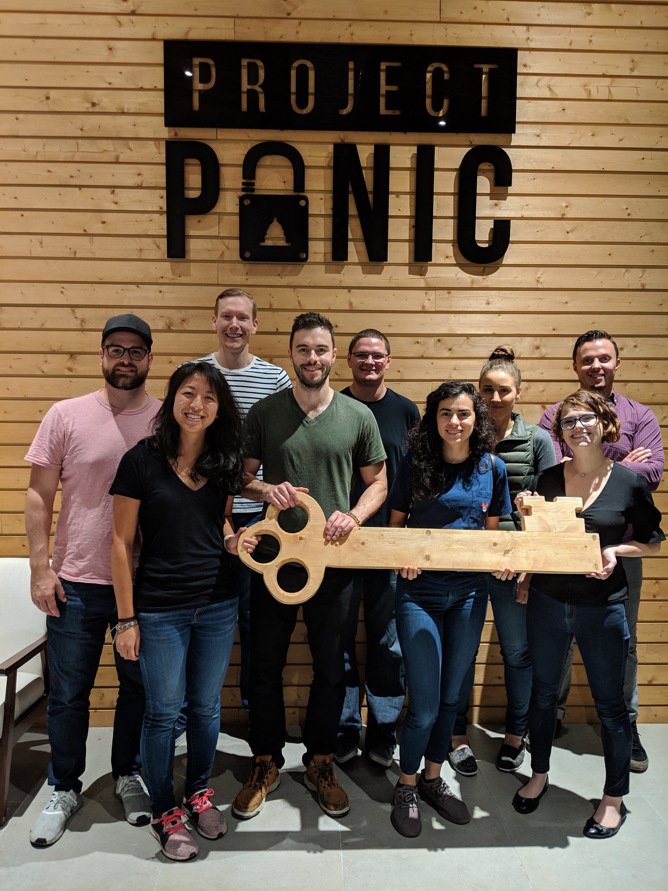

import ArticleLayout from "components/articles/ArticleLayout";

export const meta = {
  title: "From bootcamp grad to senior developer",
  date: '2020-04-05T22:12:03.284Z',
  description: "How to accelerate your growth",
  cover: 'tulip.jpeg'
}

## Beginnings

The moment I decided to become a software developer, I was sitting in the basement of a hostel in Peru.

This was 2015. In 2014, I had graduated university with a degree in English Literature. But what was I supposed to do now?

(For those considering a degree in literature the answer is... not a lot.)

I had originally wanted to be a high school teacher, but decided I wanted more. More control over my time, more rewards for excelling.

Okay, so I wouldn't be a teacher. So what would I be instead? What did I _actually_ want?

In truth, I had no idea. No pressure.

So I did what I could: I typed into Google "what is a good career?" Sitting there, in the basement of a crowded hostel, with no direction in my life, I scrolled through pages of career options.

Finally, my eye fell on "UX Designer." Sounded neat. I'd get to design cool apps. But what if I could build them, too? A few days later, I decided I was more interested in the coding side. I started researching becoming a developer.

That was the beginning.

_Obligatory Machu Picchu picture. Not where I decided to be a dev._

## Bootcamp

When I got back from South America, I took an entry-level customer service job. I was making $29,000 a year.

I started studying JavaScript in my spare time. I discovered that I liked it. I really, _really_ liked it. But it was hard to figure out what it would take to get me a job, and I was impatient to get going with a real career.

I found out about a local coding bootcamp through a friend from high school. I decided to apply. Eight weeks of grinding and $9000 later, I graduated. I was a junior developer.

Which sounded great on paper, but didn't mean much. Could I really hack it as a dev?

_My bootcamp, Lighthouse Labs. I'm in the front middle._

## Working life

I was fortunate enough to get a job at a local startup (more on that later), and found that I did in fact love the work. And I was pretty good at it, too.

After a year, I moved up to being the lead developer. Six months after that, I took a job at Indeed.com.

In July of 2018, I was promoted to the official title of "Senior Software Engineer." The title itself didn't mean much, except to emphasize the journey so far. This was almost exactly three years since the hostel basement.

In three years, I'd gone from having no coding experience to being a full-time developer. My salary had gone from $29,000 to the mid six figures. Best of all, I loved the work I was doing.

_The first team I worked with @ Indeed. Very talented at development + escape rooms._

## What I learned

I have been very very lucky. I was supported by incredible friends, colleagues, and mentors along the way.

But I don't think I'm that exceptional. The same path is possible for any aspiring developer, if they're willing to work hard. I've picked up a few things along the way that helped accelerate my progress, and I want to share them with you.

If you want to go from junior to senior—or from zero to senior—in as little time as possible, here's what I recommend.

## Takeaway #1: Ask lots of questions...

Last year I conducted a lot of job interviews for people wanting to join Indeed. The way we structured it was to have them complete a 1-2 day project, simulating real working conditions. We were available over chat or video call to support them all day long, and they had to build us a working application.

One of my biggest red flags was **if they asked no questions**.

Sure, we tried our best to clearly explain the task at hand and provide good documentation. Maybe we were just great explainers.

But still... **no clarification? No consultation on technical choices? No questions about how to excel?** Red flag.

Why did I think this was important? Because I had worked with plenty of developers (junior and senior), who I would give a task to, and they would then go off and disappear for a few days. They would come back and say "finished!" and I would look and see that they had gotten it... all wrong.

I didn't want to hire people like that.

Five minutes of clarification or technical consultation can save days of wasted effort.

If you have a question, ask. If you want to discuss the best way to do something, ask. Most developers love those discussions. Most managers love to help.

And in the end, you get the work done right.

## Takeaway #2: ... but don't ask too soon

The caveat to the above is to **ask _good_ questions.**

That means... you know what you're talking about. You're not asking for someone to hold your hand. You have a specific query, and you want a specific answer.

That means **you've tried to solve it yourself.**

Some examples:

- Not sure what technology to use for a task? Investigate a few options, then ask a senior developer for help choosing one of them.
- Not sure the best way to architecture a feature? Make a rough design, and get feedback.
- Not sure the syntax for a specific command? Google the heck out of it, and only then, ask.

The **single best possible way to phrase a question is:**

"I want to do X, and I've tried Y and Z. It's still not working. What am I doing wrong?"

Don't waste people's time.

## Takeaway #3: Focus on impact

Once you have your first software job, how do you decide what to work on?

Your manager will certainly do some of the deciding for you. But there's usually a lot of flexibility in what projects or tasks you take on. So which do you pick?

Here's my rule of thumb: **focus on business impact.**

Whatever will make the biggest difference to the goals of your team or the company... **choose that.**

Choose work that is:

- intimidating
- out of your comfort zone
- important to your manager (good)
- important to your manager's manager (better)
- going to make a lasting difference to your company's success (best)

It's easy to only work on things that you already know how to do, or that seem fun, or that seem lazy. Avoid that tendency.

**Make the biggest impact you can, and you'll be rewarded for it.**

## Takeaway #4: Make decisions, then reflect

Here's how I got my very first software job. At the end of my bootcamp, we created a group project and presented it to potential employers. They walked around and spent some time talking with us.

They asked (in short): "**What technical decisions did you make when building this? How did that work? What would you do differently next time?"**

I got an interview because I was able to answer those questions well. I had specific examples of what I wished we had done instead (hint: our code was a goddamn mess).

Then, in the interview, they had me build a practice project. Again, the same questions. **"What decisions did you make? Why? What would you change, in retrospect?"**

Being a software developer is not about writing as many lines of code as possible. **It's about making good technical decisions, as often as possible.**

So make decisions, then think about whether they were good ones. They probably weren't, in some way or another, so learn from that.

## Takeaway #5: When in doubt, build

Let's expand on the previous point.

If being a great software developer is about making sound technical decisions, how do you become a better developer?

**By making lots of decisions, and learning from them.**

That means... building stuff. Building real applications, and trying to solve problems. Making terrible, uninformed choices, and then learning from them, and making slightly better choices the next time.

This is my single biggest piece of advice to developers looking to stand out: **keep building.**

I learned JavaScript on my own, prior to the bootcamp, by trying to make an app for organizing and cataloguing my clothes. It was terrible and disorganized. Then I discovered jQuery, which helped make my JavaScript cleaner. I then **implicitly** understood jQuery's value.

Because I had made mistakes with JavaScript, I understood the benefit of bringing in a library. It was the same thing when I later learned React. Because I understood the difficulty of building complex UIs, **from experience**, I understood why I needed React.

**Build things. Make bad decisions. Learn from them.**

## How can I help?

I wrote this article because I thought it might offer some value, and also because I want to hear from you!

If you're a self-taught developer or a bootcamp grad, or just struggling in your software job hunt, let's chat.

Join my email list below and I'll personally reach out. Maybe I can help.

Thanks for reading!

export default ({ children }) => (
  <ArticleLayout meta={meta}>{children}</ArticleLayout>
);