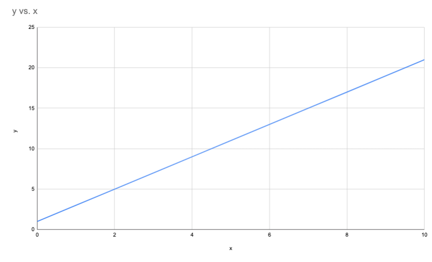
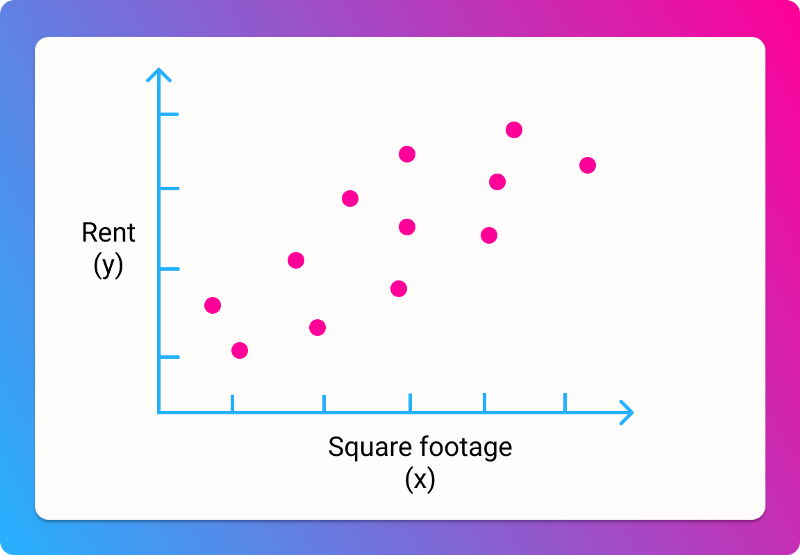
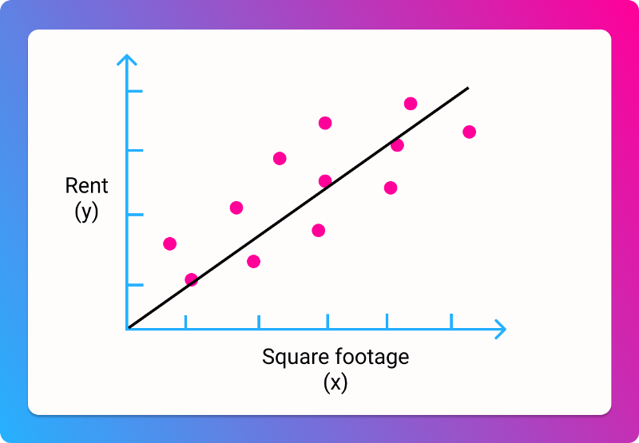
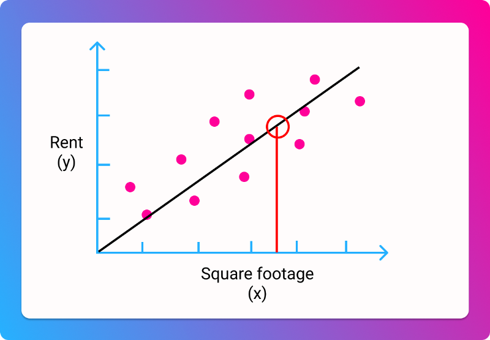

import ArticleLayout from "components/articles/ArticleLayout";

export const meta = {
  title: "The cost function in machine learning",
  date: '2021-02-23T22:12:03.284Z',
  description: "Breaking it down, step by step",
}

> $$J(\theta_0, \theta_1) = \frac{1}{m}\sum_{i = 1}^m(h_\theta(x)^{(i)} - y^{(i)})^2$$

Yep, I hit with you a scary-looking equation as soon as you opened the article. To my math-averse readers, I'm sorry.

But that's the point of this article. The above equation is essential to understanding practical machine learning. It's the key to solving many real-world learning problems.

So today I'd like to take that equation, in all its intimidating complexity, and break it down so that it makes perfect sense to you.

Trust me, it'll be easier than you think!

## Why this equation?

Math can be an immediate source of fear for many people, especially something of this complexity. But at the end of the day, math is just a way of representing reality: it's a language of the world. And therefore anyone can make sense of it: we just need a map.

This article is an attempt to map out the above equation.

Why this equation? This equation is called a cost function, and it's of central importance to machine learning. If you take [Andrew Ng's excellent Stanford course](https://www.coursera.org/learn/machine-learning/home/welcome) on machine learning, it's one of the first things you'll encounter.

It is, as we shall see, a measurement of improvement. But we'll get to that.

Right now, pour a cup of coffee, take a deep breath, and let's start unpacking this thing.

## Start with a graph

Let's start with a simple equation:

> y = 2x + 1

You can plug in any value of x to get the corresponding y. For example, if we say $$x = 2$$, then $$y = 2 * 2 + 1$$, or 5. If $$x = 3$$, $$y = 2 * 3 + 1$$, or 7.

We can plot these values on a graph. 

This graph allows us to make predictions. For any given x value, we can look at the graph and find the corresponding y.

Our predictions are always right, because y always equals 2x + 1. But in the real world, relationships aren't always so simple (am I right or am I right).

Let's switch to using some real data. Let's say you're looking for a house, and trying to find a good price per square footage. We have data on a bunch of houses, with their total price and their size in square feet. We can plot it like so:

It's clear that there isn't going to be a simple line that goes through all the data. But we can probably draw a line of "best fit", that gets us reasonably close:

Many machine learning problems involve trying to find that line, so that we can make the best possible predictions. In this case, we're predicting the price for a given square footage.

Using that line, here's how we'd make a prediction:

So for any collection of data, we want to find the equivalent of $$y = 2x + 1$$, so we can draw a line of best fit, so we can make predictions

## Our goal

Let's say we have a new collection of housing data, and we don't know much about it.

We don't know that $$y = 2x + 1$$. Right now, all we know is that the price probably roughly equals the square footage multiplied by some number, added with some other number. That's our guess.

In mathematical terms:

> price = square footage * a + b

Here, $$a$$ and $$b$$ are our mystery numbers. We don't know what they are. But if we did know what they were, we could make predictions about the price, based on the square footage.

Our goal is thus to find the $$a$$ and $$b$$ values that correspond to the best possible prediction.

Keep that goal in mind, because the rest of the article will be discussing how to get there.

## How we'll achieve our goal

In fact, let's clarify that goal a bit, by talking about the process by which we'll achieve it.

Machine learning sounds really fancy, but it's actually a bit unsophisticated when you get right down to it. The process by which our machine learns is by making incrementally better guesses.

In this case, we will guess a value for $$a$$ and $$b$$, plug it into our equations, and then run it in against our data. For each $$x$$ value (a house's square footage, from our dataset), our guess will generate a $$y$$ value, a predicted price. At first, it will probably be very, very wrong.

Over time, we want to adjust $$a$$ and $$b$$ so that our predicted prices are less wrong. Being less wrong can be rephrased as _minimizing our error_.

To put it another way: Based on our housing data, we want to find the values for $$a$$ and $$b$$ that lead to smallest possible difference between our predicted prices, and the actual prices.

## Minimizing the error

In mathematical notation, we put this as minimizing the error for $$a$$ and $$b$$, which we write as so:

$$J(a, b)$$

The $$J$$ stands for minimizing the error for the value of these variables. 

Now, we have to do one more math-y translation here. For machine learning, we prefer using the theta symbol to represent these values. It's just convention.

So we can make a = $$\theta_0$$ and b = $$\theta_1$$

Nothing has changed here, we're just using different symbols.

We rewrite our goal as...

$$J(\theta_0, \theta_1)$$

... which means we want to minimize the error for the values of theta 0 and 1, after we plug them into our equation.

Still with me? Nothing has changed in terms of our objective, we're just phrasing it in a different way. We want to make the best possible prediction for price, given a square footage.

## Putting (half of) it together

Let's look back at the full equation:

> $$J(\theta_0, \theta_1) = \frac{1}{m}\sum_{i = 1}^m(h_\theta(x)^{(i)} - y^{(i)})^2$$

You now understand the left side! The left side says "this is our goal" and the right side says "this is how we'll calculate it." So let's zoom in on the right side.

## The hypothesis function

Remember that we started with this function for predicting price:

> price = square footage * a + b

We can write this as:

> $$y = ax + b$$

Or, using our new theta:

> $$y = \theta_0x + \theta_1$$

These all mean the same thing.

When we guess values for $$\theta_0$$ and $$\theta_1$$, and plug them into our equation, we end up with a predicted price, or a predicted $$y$$ value. This is our hypothesis of what the price should be for a given square footage. It's probably wrong.

Another way of framing it as a hypothesis is to called it $$h_\theta(x)$$. In math-y terms, this stands for "our hypothesis for a given square footage, based on our guess for the two theta values."

This equation is the same as the three above:

> $$h_\theta(x) = \theta_0x +\theta_1$$

To put it in English once more: we guess the values of $$\theta_0$$ and $$\theta_1$$, and then calculate the result for a given value of $$x$$ (square footage), which gives us a prediction for what the price will be, which we can then compare with the real values. The comparison with real values is not yet shown here, so we'll add that next.

## Comparing our prediction with reality

In order to improve our prediction, we need to understand how wrong we are. We need to compare our prediction with the real value, and find the difference between the two.

> how wrong we are = our predicted price for a given square footage minus the real price for a given square footage

Or

> error = predicted price - real price

Or

> $$error = h_\theta(x) - y$$

Here, we're bringing back $$y$$ to represent the real price value. All three of the above equations are equivalent.

Now, the above equation will either yield a negative or a positive value. If our prediction is lower than the real price, we'll get a negative number. If it's higher, we'll get a positive.

It's generally easier to work with positive numbers, so let's square (multiply it by itself) our result to ensure it's positive.
> $$squared error = (h_\theta(x) - y)^2$$

This has the side effect of making our error appear larger than it is, which is actually good, because we want to be really sure we're getting less wrong

## Adding our errors together

The above equation will tell us how wrong our predicted price is for a certain house. But we want to know how wrong we are for all houses in our dataset.

So here's what we'll do:

- Guess a value for $$\theta_0$$ and for $$\theta_1$$ 
- For each house in our dataset, we'll plug in its square footage, and come up with a predicted price.
- For each house, we'll subtract that prediction from the real price, and then square the result.
- We'll add up all our squared errors, and divide it by the number of houses, to get the average error.

At the end of this process, we'll end up with our average squared error, or mean squared error. This is often denoted by MSE. It is a measure of how wrong we were across all our data.

In math, we use the sigma symbol to denote that we're adding up a series of values. For example:
> $$\sum(1, 2, 3, 4)$$
... means that we're adding up 1 + 2 +3 + 4.

Or let's say we have two sets of values, prices and square footages.

> $$\sum_{i = 1}^m(price^{(i)} + squarefootage^{(i)})$$

Now, we added a bit more notation. The $$m$$ stands for the number of values for prices and square footage (AKA the number of houses). The $$i = 1$$ means we're starting from the first value, and adding each one up in turn.

In short, this equation just means "add up the price and square footage for each house, and then add all the results together."

Remember that this is how we calculate the squared error for each prediction:
> $$squared error = (h_\theta(x) - y)^2$$

To take the sum of the errors for every prediction, we do this:
> $$\sum_{i = 1}^m(h_\theta(x)^{(i)} - y^{(i)})^2$$

This will give us a sum of all our squared errors, across all houses. To take the average of it, we need to divide it by the number of houses. We've previously defined that as $$m$$, so...

> $$\frac{\sum_{i = 1}^m(h_\theta(x)^{(i)} - y^{(i)})^2}{m}$$

That's kind of hard to read, since it's so small. But dividing by $$m$$ is the same as multiplying by $$\frac{1}{m}$$, so we rewrite it like so:

> $$\frac{1}{m}\sum_{i = 1}^m(h_\theta(x)^{(i)} - y^{(i)})^2$$

That gives us our mean squared error. 

## Putting it ALL together

Now we know how to calculate our error across all houses in the dataset. Our goal is to minimize that error. We can express both the calculation, and the objective, like so:
> $$J(\theta_0, \theta_1) = \frac{1}{m}\sum_{i = 1}^m(h_\theta(x)^{(i)} - y^{(i)})^2$$

... which you may recognize as our initial equation. Great job!

We've put it all together. We've expressed our objective as minimizing how wrong our prediction is. We've learned how to calculate how wrong our prediction is, and express that mathematically. We've taken a big, complex equation, and broken it into little pieces.

I know an article like this isn't easy to work through, so congrats on making it this far!

You know understand the basis of machine learning. For more, check out [my article on gradient descent](/how-gradient-descent-works/), or subscribe to my email list.

export default ({ children }) => (
  <ArticleLayout meta={meta}>{children}</ArticleLayout>
);
