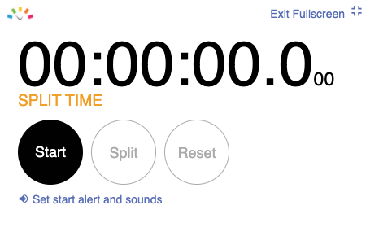
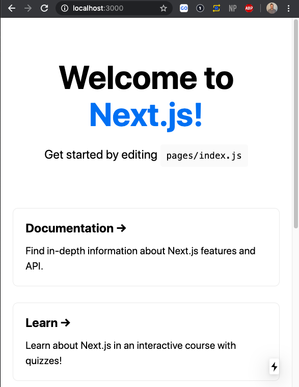
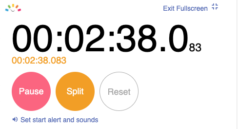
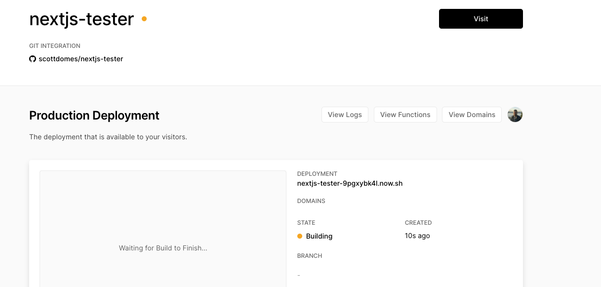
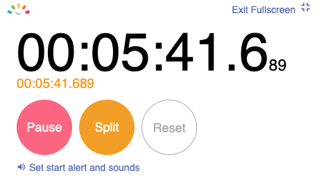
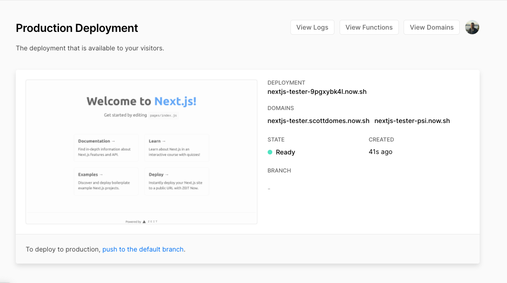
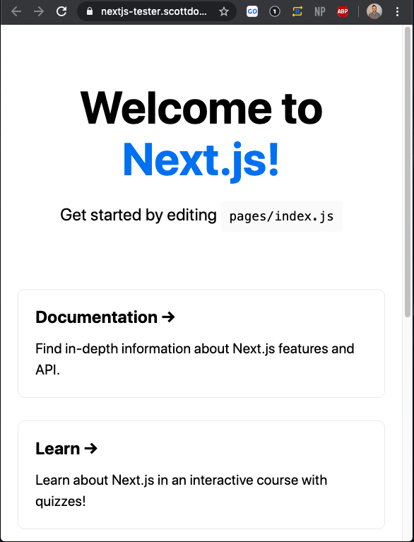
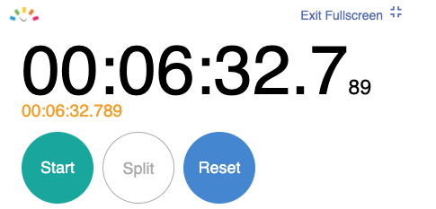

import ArticleLayout from "components/articles/ArticleLayout";

export const meta = {
  title: "How to create and deploy a Next.js app in... 6 minutes 32 seconds",
  date: "2020-04-23T22:12:03.284Z",
  description: "Modern web development is easy, y'all",
};

As I start this article, I have 35 minutes until a work meeting.

I have never used Next.js before, but in that time, I want to create and deploy a new application.

... hopefully less time. I'd like another cup of coffee before work.

_Anyway_, let's dive in.

## Goal

Simple: to create a new Next.js application, and deploy it to a public URL.

I don't intend to make any code changes at this time. I want to go live as soon as possible, and go from there.

Let's get started.

Time on the clock: 0.00.



## Setting up

I expected to have to install a command line tool, but instead, it's as simple as the running the following:

```
npm init next-app nextjs-blog
```

That's nice.

Next, it asked me to select a template. I chose the default. I'm not picky here, Next.js.

A minute later, it's done. I can run it locally with:

```
cd nextjs-blog
yarn dev
```

And I see:



Good progress so far!



## Deploying

Alright, I guess it's time to deploy!

This almost feels like cheating. I have a real working application in two minutes, and I'm ready to put it on the internet. We are truly spoiled these days.

First, I create a Github repo:

[My repo!](https://github.com/scottdomes/nextjs-tester)

Then I sign up for [Vercel](https://vercel.com) with my Github account, and use [their import tool](https://vercel.com/import/git). For the privacy-minded, note that I only gave the Vercel integration access to this one repo.

A moment later, my repo is imported to Vercel. I click the big DEPLOY button.

It's deploying!



Time check:



HURRY UP! I DON'T HAVE TIME FOR... oh.



It's done. It's live.



Plenty of time left before my meeting:



There you have it, folks. Next.js is really easy to get started with. Go try it out.

People often complain about front-end tooling in the modern age, but it's getting rapidly better. I've had similar experiences with Gatsby + Netlify for deployment. It's crazy that we have MULTIPLE amazing build + deployment tools.

This article is not sponsored by Vercel, by the way (but if you're reading this, Vercel, call me).

This is not the end of the road for my Next.js app, by the way. I plan to expand it to be a fully functional blog. If you want to continue along with me on my journey, join my newsletter below.

export default ({ children }) => (
  <ArticleLayout meta={meta}>{children}</ArticleLayout>
);
