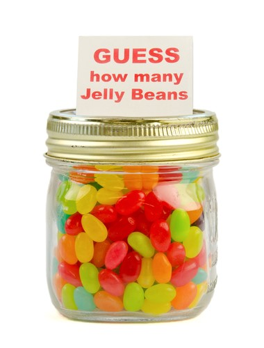
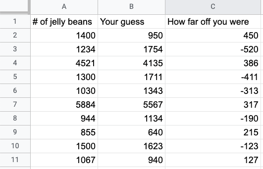
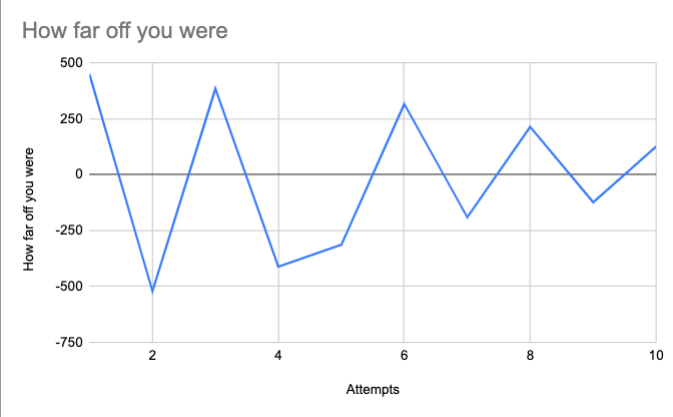
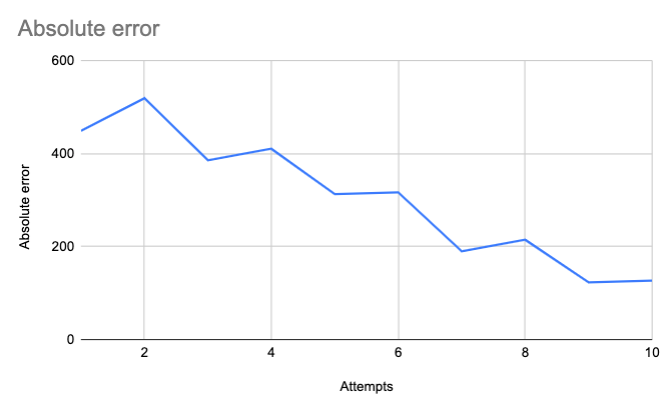
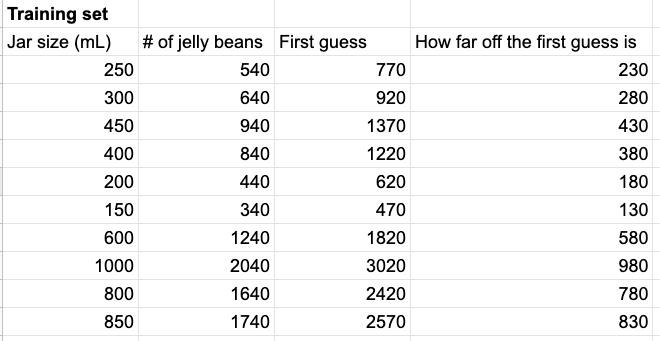
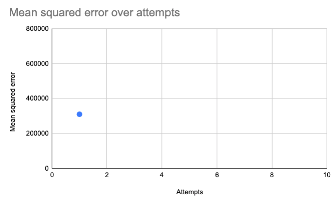
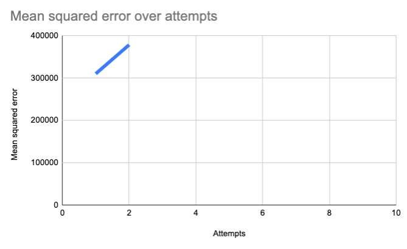
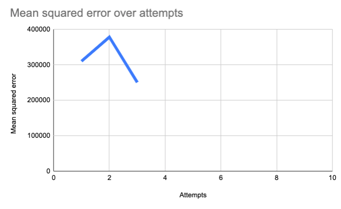
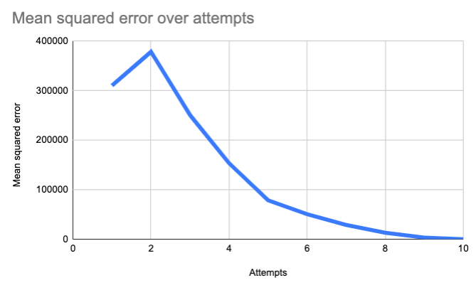

import ArticleLayout from "components/articles/ArticleLayout";

export const meta = {
  title: "How gradient descent works",
  date: "2021-02-18T22:12:03.284Z",
  description: "Learn how machine learning algorithms get less wrong over time",
};

Machine learning is the process by which an algorithm gets smarter over time. _Smarter_ in this case means _better at prediction_.

We could also define becoming _smarter_ as becoming _less wrong._ That definition works for both humans and machines: the purpose of learning is to _try to be wrong less often._

The mechanism by which machine learning achieves this (in many cases) is called **gradient descent**. In this article, **you'll learn what that is and why it matters.**

But before we get there, let's talk about... jellybeans. More specifically, let's talk about how _you_ learn.

## Human learning

Do you remember those contests at school fairs where you had to guess the number of jelly beans in a jar? I was pretty bad at it, as I imagine most people were.

But I think it's fair to say that if you really practiced jelly bean guessing, you'd get better at it.

If you trained with a bunch of different jars, over a period of months, you'd probably get more and more accurate with your guessing. Your parents might worry about you/wonder when you're going to move out of their basement, but you'd win more jelly bean prediction contests.

How would you get better? Well, you'd learn that a small jar corresponds with a certain amount, a larger jar with a larger amount, and with enough practice... you'd be able to look at the size of a jar and come up with a pretty good guess.

## Tracking progress

If you wanted to visualize your progress over time, you could graph it.
The best measure would be the difference between your guess and the actual number of jelly beans in the jar. We can define this as _a measure of how wrong you are,_ for a given jar.

Let's say these values represent the difference between your prediction and the actual amount:

Sometimes you guess too many, sometimes too few.
We can graph it like so:

For simplicity's sake, we can change this graph to treat positive and negative differences as the same thing; if you're under by 3 jelly beans, that's the same amount of "wrong" as being over by 3 jelly beans.

In technical terms, treating positive and negatives the same is called **taking the absolute of each error**, which yields the following graph:

Your absolute error decreases over time, which shows you're learning!

<Quizlet
  question="What does a decreasing absolute error mean?"
  answers={[
    "Our algorithm is getting dumber",
    "Our algorithm is getting smarter",
  ]}
  id="absolute-error"
  indexOfCorrectAnswer={1}
/>

## Descending

You can think of the line in that last graph as your "wrongness" or your _error_. As you get better at guessing, your error slopes towards zero.

Remember that an error of zero means there is no difference between your guess and the number of jelly beans, which means you are _exactly correct_.

As the slope descends over time, it means you're becoming less and less wrong.

We call this **minimizing error.**

> MINIMIZING ERROR = DESCENDING THE SLOPE = BEING LESS WRONG

## How machines learn

In machine learning, we follow the same process.

Let's say you're trying to figure out the algorithm for jelly beans. **For a given jar volume**, **you want to be able to figure out the number of jellybeans**.

(Necessary caveat: my jelly bean calculations for the rest of this article are approximations only, and should not be used to try to win any contests. I'm assuming jelly beans are always the same size.)

We're trying to figure out the relationship between two variables: **jar size, which we'll call x, and jelly bean count, which we'll call y.**

**For a given jar size (x), we want to be able to guess the jelly bean count (y).**

We can state this another way. We want to _minimize the wrongness of our prediction._

For each guess, we want to have the _lowest possible error_. So **for a given x value, we want to try to find the y that gives us the lowest possible error.**

## Guessing and learning

To teach our algorithm to guess jelly beans, we give it a training set: a bunch of correct data about jar sizes and jelly beans counts.

The actual relationship between these values is that _the number of jelly beans = twice the jar size plus forty_. But our machine doesn't know that yet; that's what it's trying to figure out.

> Correct answer: y = 2x + 40

So we start training. We start our machine off with a random guess. Let's say we guess that _the number of jelly beans equals three times the jar size plus twenty_.

> First guess: y = 3x + 20

Our ML algorithm runs through the training set, applying this calculation and comparing it to the right answer. For each jar, it's off by a certain amount. We add all those errors together and average them.

This number could be negative or positive, but in machine learning we generally square the errors before adding them up. This is called **the mean squared error, or MSE.**

MSE is just a measure of how wrong we are. For this training set, here's how far off we were for each value:

All these errors are positive, since we overshot the values. This makes sense, since we multiplied our jar size by 3 instead of 2. (Remember that the correct algorithm is _2x + 40_, and we guessed _3x + 20_.)

**To calculate the mean squared error, we square all these errors and add them up, then divide them by the number of guesses.**

Your first thought might be whoa, that's a big number! That's actually a good thing, though. Squaring the error ensures it's always positive, and also means differences are magnified. Since our goal is to get as close to zero as possible, we want to be able to see big differences more clearly.

Let's put our MSE on a graph, as our first data point. Remember that the MSE is the _average_ of applying our guess to many jars. For each guess attempt (e.g. 3x + 20), we'll generate a single mean squared error.

As we make more attempts, we want to bring that value down, and get it _as close as possible_ to zero.

## Improving

So, our first guess at the algorithm was wrong. Let's take a different guess.
Instead of guessing that jelly bean count = 3 \* jar size plus 20, let's guess it will be 3.1 \* the jar size plus 19.

> Second guess: y = 3.1x + 19

We calculate the MSE, and plot it...

Oops! We're going in the wrong direction! We're ascending, which means we're getting _more_ wrong. Let's go in the opposite direction. Let's make our equation 2.9x + 21.

> Third guess: y = 2.9x + 21

Now we're descending. Over time, as we incrementally adjust those constants, we get closer to zero:

In time, we'll end up with the correct algorithm: 2x + 40. Our machine has learned how to guess jelly beans!

# Where do we go from here?

The above process is called **gradient descent**. As we saw here, _descent_ means minimizing error, or getting less wrong over time.

The term _gradient_, which we didn't cover here, is more technical. It refers to seeing how our position changes when we change one of our inputs. **By calculating the gradient of the slope our algorithm would be able to automatically "detect" which way goes downhill, and make the necessary changes.** But that relies on some more complex mathematics, which I'll cover in a future article.

I've simplified the process, but this should give you an idea of why gradient descent works to train ML algorithms.

Stay tuned for future articles discussing some of the challenges and usecases for the above process.

If you're interested, I send out a weekly newsletter covering the writing I do each week, plus interesting sources I find. Try it out:

export default ({ children }) => (
  <ArticleLayout meta={meta}>{children}</ArticleLayout>
);