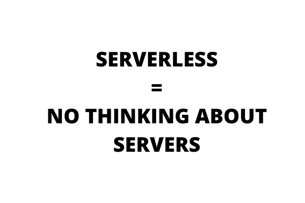
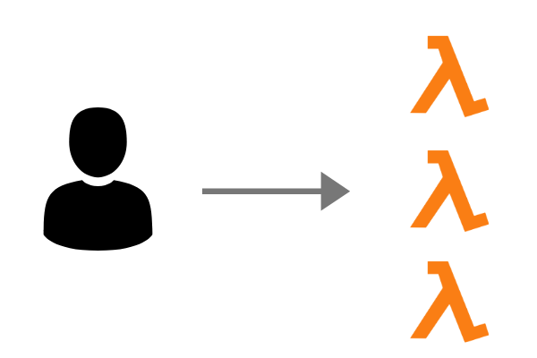
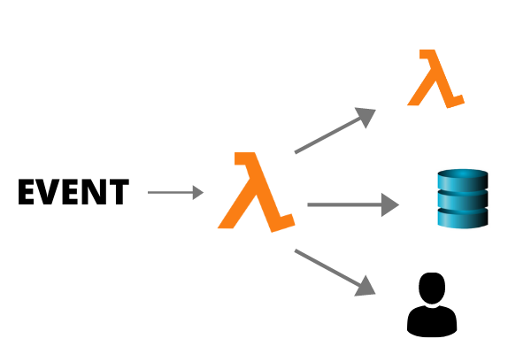
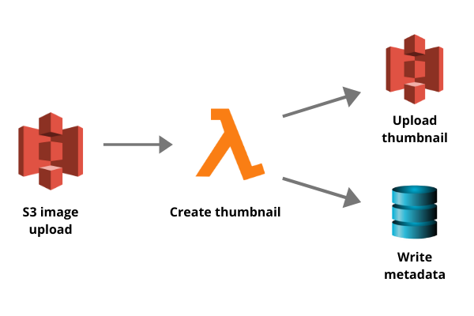
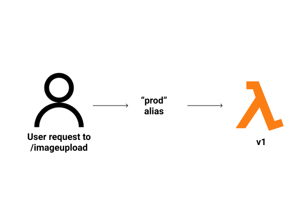
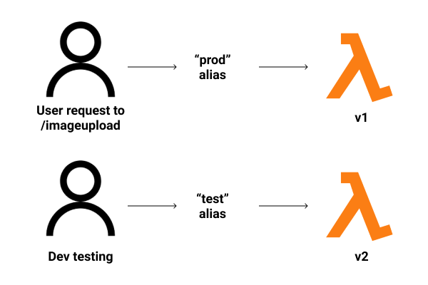
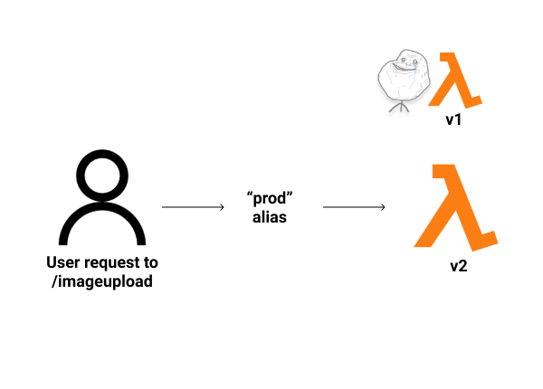

import ArticleLayout from "components/articles/ArticleLayout";

export const meta = {
  title: "How AWS Lambda works",
  date: "2020-04-22T01:12:03.284Z",
  description: "What the heck is serverless?",
};

Why you should care about AWS Lambda:

- it's one of the most popular services on Amazon Web Services (AWS)... or at least one of the most _talked_ about
- it's an incredibly cheap way to build your application
- it's a big part of AWS's "serverless" architecture

Which leads us to our first question... what the heck is serverless, anyway?

## What does serverless mean?

Serverless architecture is a lie.

Or, at least, a misleading name.

**Serverless doesn't mean _no_ servers are involved, it just means you don't have to _think_ about those servers.**

You don't have to manage them, or provision them, or upgrade them... you do nothing.

AWS handles the hard stuff.

## Just functions, baby

But Lambda takes it even further than just "don't think about servers."

With Lambda, you don't manage and deploy an "application"... at least not the way you might normally think of it.

**Instead, you write and deploy _individual functions._**

That's it. That's your only responsibility.

Lambda can also be described as Functions as a Service (more on that later).

## Okay, but what do your functions do?

Well, at a fundamental level, your functions process _events._

Events can come from all sorts of places.

Here's one example.

A user makes a request to your API (managed by AWS API Gateway).

That particular endpoint is mapped to a Lambda function.

The users calls the endpoint, the Lambda funtions gets invoked. It can, in turn, invoke another function.

It could also:

- write to a database
- call another AWS service (e.g. send a notification through AWS SNS)
- return a response (e.g. some text content)

Functions execute simple tasks, but you can accomplish complex tasks by linking them together.

## Functions in practice

Here's another example.

A user uploads a new image to S3 (which is AWS's simple storage solutions)).

That upload triggers a Lambda function, which creates a thumbnail version of the image.

After creating the thumbnail, the Lambda function does two things:

1. Uploads the thumbnail to S3
2. Writes the metadata of the image to your database

Boom. Simple image transformation.

You could take this even further. Say that the image in question is a new profile picture for a user. The Lambda function could call ANOTHER Lambda function which updates the user profile in the database, and then returns the new profile.

Adding complexity is just a matter of adding more functions.

## Making big stuff happen

You can thus compose a full application by creating individual Lambda functions.

But each is managed separately.

You can update each function individually, and your "deploy process" is mostly just uploading the new code to the Lambda dashboard.

Thus... Functions as a Service.

## How do I keep track of my changing functions?

Lambda functins are _versioned_ and _aliased_.

This makes updating safe and easy.

So let's say you make a Lambda function. It's on version 1 (v1).

You create an endpoint in AWS API Gateway. Let's call it `/imageupload`.

You create an alias for v1 of your function, and name it **prod**.

You map `/imageupload` to point to **prod**. When a user makes a request to `/imageupload`, the v1 Lambda function is invoked.

But then it's time to update your function. You upload a new version to Lambda. That's v2.

You alias v2 and name it "test".

The **prod** alias is still pointing to v1. Users are still ONLY interacting with v1.

You can test v2 thoroughly, and when you're happy, you point the **prod** alias to v2.

Now, all requests to `/imageupload` are routed to v2.

You can also do partial allocation, like routing 60% of traffic to **prod** to v1, 40% to v2... and then slowly ramp up v2. This is the safest approach.

## Okay, but what about the money??

So that's the workflow.

Individual functions, triggered by events.

But what makes Lambda particulary appealing is its low cost.

When you deploy a typical back-end application, you deploy _instances_ to _servers_. Depending on your setup, you then have to manage those instances and servers.

How much management? Depends. But at the very least, you have to keep your instances running... all the time.

They have to be ready to receive requests, so the application MUST be running. That costs $$$.

With Lambda, it's different.

**You only pay when your functions are invoked.**

So if a function isn't called... you pay nothing for it.

Again, you have to do zero thinking about servers... so it's called serverless.

Your functions are always ready to be invoked. Always.

And they scale out to meet your needs. If you have 0 requests one second and 10,000 requests the next... Lambda is ready for it.

Easy scaling + very cheap. Good combination.

The only thing to note is that Lambda has an execution time limit, which means they're meant for short, quick tasks. Not long-running tasks, like crunching data.

## Wrap it up

In conclusion, Lambda is neat because it:

- Allows you to deploy individual functions
- Allows those functions to easily interact with other AWS services
- Is very cheap
- Scales instantly

**On another note**, I just rebooted my email newsletter. Check it out. Get articles like this + other interesting links, straight into your inbox, once a week.

export default ({ children }) => (
  <ArticleLayout meta={meta}>{children}</ArticleLayout>
);
