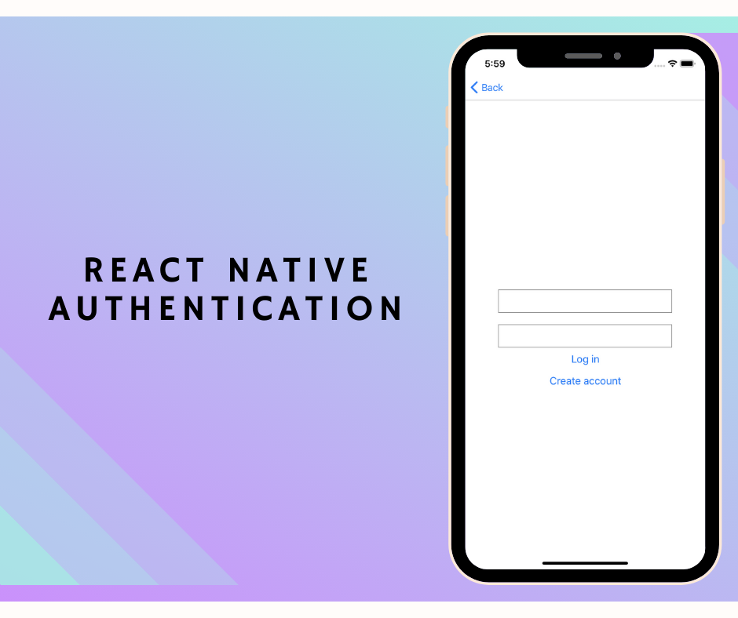
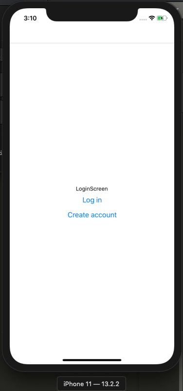
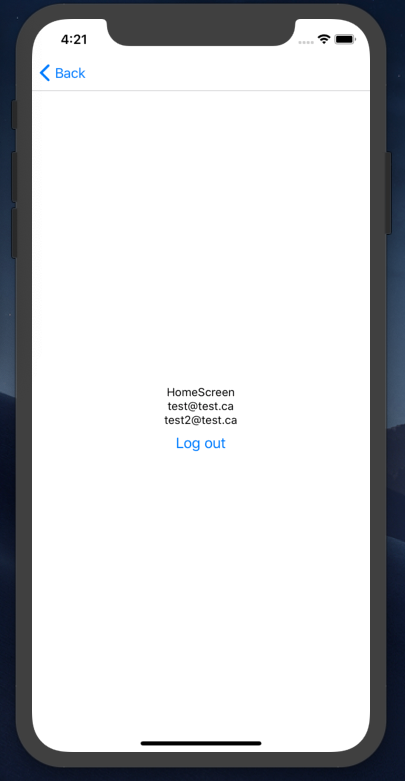
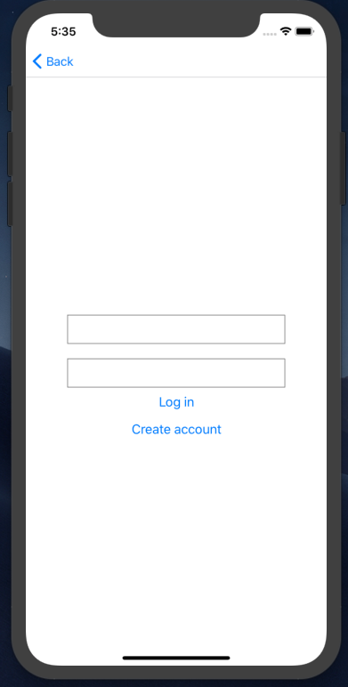

import ArticleLayout from "components/articles/ArticleLayout";

export const meta = {
  title: "Simple React Native authentication",
  date: "2019-12-28T22:12:03.284Z",
  description:
    "Learn how to build up an onboarding and login flow with React Native",
};



## What are we doing?

Every app you build will need a login/signup funnel. It's one of the most basic building blocks of a modern app. Let's learn how to do it the fast and easy way using React Native.

Our goal is to create a React Native app with the following features:

- A user can create an account
- A user can log into their account
- Once logged in, the user can access the app home screen
- The user can manually log out
- When automatically logged out due to their session expiring, the user is taken to the login screen

## Requirements

You need a general knowledge of how modern JavaScript development works. I won't be explaining the nitty gritty of things like `npm` or how React Native actually functions.

## Setting up our project

Follow [this guide](https://facebook.github.io/react-native/docs/getting-started.html) to install dependencies and create your project. This tutorial will be aimed at developing for iOS as the target OS, using the React Native CLI approach (rather than Expo). If you want to use Expo and/or Android, you can probably modify some of the content to make it work.

Our project name can be whatever you want, but I'll be using `AuthenticationBoilerplate`.

By the end of the linked guide, you should have your project created and running in the iOS simulator.

## Part 1: Navigation

Our app includes the following navigation flows:

- When the user logs in successfully, they are taken to the home screen.
- When the user clicks the 'Create account' on the login screen, they are taken to the create account screen.
- When the user clicks the 'Log in' link on the create account screen, they are taken to the login screen.
- When the user clicks the 'Log out' link on the home screen, they are taken to the login screen.

A whole bunch of functionality will need to happen between this navigation, but making sure we can navigate successfully seems like a good start.

To support moving between screens, we're going to use the `react-navigation` package.

### Setting up `react-navigation`

Installing the necessary dependencies should be straightforward:

```bash
yarn add react-navigation
yarn add react-native-reanimated react-native-gesture-handler react-native-screens react-navigation-stack
cd ios
pod install
cd ..
```

After running `pod install`, you should see something close to the following output:

```
Detected React Native module pods for RNGestureHandler, RNReanimated, and RNScreens
Analyzing dependencies
Downloading dependencies
Installing RNGestureHandler (1.5.2)
Installing RNReanimated (1.4.0)
Installing RNScreens (2.0.0-alpha.22)
Generating Pods project
Integrating client project
Pod installation complete! There are 31 dependencies from the Podfile and 29 total pods installed.
```

If that doesn't work, check their (official guide to getting started)[https://reactnavigation.org/docs/en/getting-started.html].

### Creating our screens

As established above, we need three screens:

1. HomeScreen
2. LoginScreen
3. CreateAccountScreen

In our project, create a new directory called `src/` and then a new directory inside that one called `screens/`. Inside `src/screens/`, create a file for each of our screens (e.g. `HomeScreen.js`).

For now, each file can look roughly like so:

```jsx
import React from "react";
import { View, Text } from "react-native";

const LoginScreen = () => {
  return (
    <View style={{ flex: 1, alignItems: "center", justifyContent: "center" }}>
      <Text>LoginScreen</Text>
    </View>
  );
};

export default LoginScreen;
```

### Creating our navigator between screens

`react-navigation` uses the concept of a "stack navigator" for basic navigation. In short, it's a stack of screens. Open up `App.js` in the root of your project and delete its contents.

Add the following to set up our navigation:

```js
import { createAppContainer } from "react-navigation";
import { createStackNavigator } from "react-navigation-stack";
import LoginScreen from "./src/screens/LoginScreen";
import HomeScreen from "./src/screens/HomeScreen";
import CreateAccountScreen from "./src/screens/CreateAccountScreen";

const AppNavigator = createStackNavigator(
  {
    Home: HomeScreen,
    Login: LoginScreen,
    CreateAccount: CreateAccountScreen,
  },
  {
    initialRouteName: "Login",
  }
);

export default createAppContainer(AppNavigator);
```

Reload your app (CMD + R from the simulator on Mac) and you should see the text 'LoginScreen'.

If you get the error `Direction is undefined`, try restarting the simulator, or double check you ran `pod install` when installing the packages as described above.

### Simple navigation

Alright, let's set up some simple navigation actions. To summarize, each screen allows the following actions:

1. From the LoginScreen, the user can go to the CreateAccountScreen or the HomeScreen.
2. From the CreateAccountScreen, the user can go back to the LoginScreen.
3. From the HomeScreen, the user can go back to the LoginScreen.

Each screen automatically receives a `navigation` prop by virtue of the stack navigator. Let's set up some buttons for easy navigation.

HomeScreen:

```jsx
import React from "react";
import { View, Text, Button } from "react-native";

const HomeScreen = ({ navigation }) => {
  return (
    <View style={{ flex: 1, alignItems: "center", justifyContent: "center" }}>
      <Text>HomeScreen</Text>
      <Button title="Log out" onPress={() => navigation.navigate("Login")} />
    </View>
  );
};

export default HomeScreen;
```

LoginScreen:

```jsx
import React from "react";
import { View, Text, Button } from "react-native";

const LoginScreen = ({ navigation }) => {
  return (
    <View style={{ flex: 1, alignItems: "center", justifyContent: "center" }}>
      <Text>LoginScreen</Text>
      <Button title="Log in" onPress={() => navigation.navigate("Home")} />
      <Button
        title="Create account"
        onPress={() => navigation.navigate("CreateAccount")}
      />
    </View>
  );
};

export default LoginScreen;
```

... and I'm sure you can figure out `CreateAccountScreen` from there.

With that done, you should be able to click around your app, moving from screen to screen. Success!



## Mock API

For real authentication, we'll call an API similar to the one we built in (my Rails authentication tutorial)[https://scottdomes.com/rails-authentication-deploy/]. But for now, for easy development, we're going to create a mock API.

A good mock API should do three things:

1. Include a delay for sending/receiving data.
2. Mimic the inputs and outputs of a request.

In our `src/` directory, create a new folder called `api/` and a new file called `mock.js` inside.

Two initial methods:

```js
const mockSuccess = (value) => {
  return new Promise((resolve) => {
    setTimeout(() => resolve(value), 2000);
  });
};

const mockFailure = (value) => {
  return new Promise((resolve, reject) => {
    setTimeout(() => reject(value), 2000);
  });
};
```

These methods mock the success or failure of an API call (based on a promise) after two seconds, and return the passed-in value.

This allows us to create our login method:

```js
export const login = (email, password, shouldSucceed = true) => {
  console.log(email, password);

  if (!shouldSucceed) {
    return mockFailure({ error: 500, message: "Something went wrong!" });
  }

  return mockSuccess({ auth_token: "successful_fake_token" });
};
```

The `shouldSucceed` parameter allows us to dictate if we want to mock the success of failure of this request. This parameter is for development only, and will soon be removed.

If the request is successful, we return a JSON web token. For more, see [my Rails authentication tutorial](https://scottdomes.com/rails-authentication-deploy/).

If the request is not successful, we return a human-readable error.

Make the same method for `createAccount`:

```js
export const createAccount = (email, password, shouldSucceed = true) => {
  console.log(email, password);

  if (!shouldSucceed) {
    return mockFailure({ error: 500, message: "Something went wrong!" });
  }

  return mockSuccess({ auth_token: "successful_fake_token" });
};
```

And then a couple of methods for fetching the list of users:

```js
const getAuthenticationToken = () => "successful_fake_token";

export const getUsers = (shouldSucceed = true) => {
  const token = getAuthenticationToken();

  if (!shouldSucceed) {
    return mockFailure({ error: 401, message: "Invalid Request" });
  }

  return mockSuccess({
    users: [
      {
        email: "test@test.ca",
      },
      {
        email: "test2@test.ca",
      },
    ],
  });
};
```

This method will send the appropriate token. We'll load the user list from the `HomeScreen`. The error ('Invalid Request') will let us know the user is not properly authenticated, and should return to the `LoginScreen`.

Now that our mock API is in place, let's start wiring requests to our screens.

### Login request

Inside our `LoginScreen`, make a new method to call the `login` method:

```jsx
import React from "react";
import { View, Text, Button } from "react-native";
import { login } from "../api/mock";

const LoginScreen = ({ navigation }) => {
  const loginUser = () => {
    login("test@test.ca", "password")
      .then(() => {
        navigation.navigate("Home");
      })
      .catch((err) => console.log("error:", err.message));
  };

  return (
    <View style={{ flex: 1, alignItems: "center", justifyContent: "center" }}>
      <Text>LoginScreen</Text>
      <Button title="Log in" onPress={loginUser} />
      <Button
        title="Create account"
        onPress={() => navigation.navigate("CreateAccount")}
      />
    </View>
  );
};

export default LoginScreen;
```

If the request succeeds (which it should automatically), we should see our fake email + password logged in the console, and then after 2 seconds we will be redirected to the `HomeScreen`.

If you pass in `false` as the last parameter of `login`, you should NOT be redirected, and you should see the error in the console.

We can do something similar for `createAccount`:

```jsx
import React from "react";
import { View, Text, Button } from "react-native";
import { createAccount } from "../api/mock";

const CreateAccount = ({ navigation }) => {
  const createUser = () => {
    createAccount("test@test.ca", "password")
      .then((val) => {
        navigation.navigate("Home");
      })
      .catch((err) => console.log("error:", err.message));
  };

  return (
    <View style={{ flex: 1, alignItems: "center", justifyContent: "center" }}>
      <Text>CreateAccount</Text>
      <Button title="Create user" onPress={createUser} />
      <Button title="Log in" onPress={() => navigation.navigate("Login")} />
    </View>
  );
};

export default CreateAccount;
```

### Error display

When our login/signup fails, we want to show a message to the user. This is easy to do with [React hooks](https://reactjs.org/docs/hooks-intro.html).

Here's an example for `LoginScreen`:

```jsx
import React, { useState } from "react";
import { View, Text, Button } from "react-native";
import { login } from "../api/mock";

const LoginScreen = ({ navigation }) => {
  const [errorMessage, setErrorMessage] = useState("");
  const loginUser = () => {
    setErrorMessage("");
    login("test@test.ca", "password", false)
      .then(() => {
        navigation.navigate("Home");
      })
      .catch((err) => setErrorMessage(err.message));
  };

  return (
    <View style={{ flex: 1, alignItems: "center", justifyContent: "center" }}>
      <Text>LoginScreen</Text>
      <Button title="Log in" onPress={loginUser} />
      <Button
        title="Create account"
        onPress={() => navigation.navigate("CreateAccount")}
      />
      {errorMessage ? <Text>{errorMessage}</Text> : null}
    </View>
  );
};

export default LoginScreen;
```

When the request fails, the error mesage should appear below the buttons.

You can copy this code for `CreateAccountScreen`.
(Some may point out that these two screens are very similar and could share code. We'll fix this in the future!)

### Loading users

As mentioned above, we want to load a list of existing users on our `HomeScreen`. If that request fails with a `401` error, the user's session has expired, and we want to redirect them to the `LoginScreen`.

To do so, we're going to refactor `HomeScreen` to be a class component using a `componentDidMount` [lifecycle method](https://scottdomes.com/react-lifecycle-methods/).

```jsx
import React from "react";
import { View, Text, Button } from "react-native";
import { getUsers } from "../api/mock";

export default class HomeScreen extends React.Component {
  state = { users: [], hasLoadedUsers: false, userLoadingErrorMessage: "" };

  loadUsers() {
    this.setState({ hasLoadedUsers: false, userLoadingErrorMessage: "" });
    getUsers()
      .then((res) =>
        this.setState({
          hasLoadedUsers: true,
          users: res.users,
        })
      )
      .catch(this.handleUserLoadingError);
  }

  handleUserLoadingError = (res) => {
    if (res.error === 401) {
      this.props.navigation.navigate("Login");
    } else {
      this.setState({
        hasLoadedUsers: false,
        userLoadingErrorMessage: res.message,
      });
    }
  };

  componentDidMount() {
    this.loadUsers();
  }

  render() {
    return (
      <View style={{ flex: 1, alignItems: "center", justifyContent: "center" }}>
        <Text>HomeScreen</Text>
        {this.state.users.map((user) => (
          <Text key={user.email}>{user.email}</Text>
        ))}
        <Button
          title="Log out"
          onPress={() => this.props.navigation.navigate("Login")}
        />
      </View>
    );
  }
}
```

There's a lot going on here, so let's unpack it:

1. When we first hit the HomeScreen, we try load the list of users.
2. If the request succeeds, we display a list of their emails.
3. If the request fails, and the error code is 401, we are redirected back to the login screen.
4. If the request fails with another code, an error message is displayed.

Try experimenting with the various results listed above. You can pass `false` to `getUsers` to make the request fail, and change the returned error code in `api/mock.js` to see what happens.

We've now successfully mocked the login flow for our app. Now we start making it more real. First step: start _really_ using an authentication token.



## Storing the auth token

With our final app, our authentication flow will go like so:

1. Create an account or log in, and get a token back from the API.
2. Save that token to device storage.
3. Include that token in every request (e.g. to `getUsers`).
4. If the API tells us the token is invalid (if it has expired), redirect back to the login screen.

Most of the above is in place with our mock API, _except_ for storing the token on the device. Let's do that now.

### Token saving

Create a new file in `api/` called `token.js`. This file is where we'll store methods for getting and saving the token.

Luckily, accessing device storage is very easy with React Native, using the `async-storage` package. You can [read more about it here](https://github.com/react-native-community/async-storage).

Note that `async-storage` isn't particulary secure, so don't use it for important information. See [this blog post](https://randycoulman.com/blog/2017/07/25/secure-storage-in-react-native/) for an overview of more secure storage options.

To get started with the package, install and link it:

```bash
yarn add @react-native-community/async-storage
cd ios/
pod install
cd ..
```

Here's what our `token.js` should look like:

```js
import AsyncStorage from "@react-native-community/async-storage";

export const getToken = async () => {
  try {
    const value = await AsyncStorage.getItem("@auth_token");
    if (value !== null) {
      return value;
    }
  } catch (e) {
    return null;
  }
};

export const setToken = async (token) => {
  try {
    await AsyncStorage.setItem("@auth_token", token);
  } catch (e) {
    return null;
  }
};
```

We add a getter and setter for `@auth_token`, along with some very basic error handling. Note that if the token is not get or set properly, the effect will be the user being redirected to the login screen on their next failed request.

### Wiring up our token

Here's how we can modify `LoginScreen` to set the token after a successful request:

```jsx
import React, { useState } from "react";
import { View, Text, Button } from "react-native";
import { login } from "../api/mock";
import { setToken } from "../api/token";

const LoginScreen = ({ navigation }) => {
  const [errorMessage, setErrorMessage] = useState("");
  const loginUser = async () => {
    setErrorMessage("");
    login("test@test.ca", "password")
      .then(async (res) => {
        await setToken(res.auth_token);
        navigation.navigate("Home");
      })
      .catch((err) => setErrorMessage(err.message));
  };

  return (
    <View style={{ flex: 1, alignItems: "center", justifyContent: "center" }}>
      <Text>LoginScreen</Text>
      <Button title="Log in" onPress={loginUser} />
      <Button
        title="Create account"
        onPress={() => navigation.navigate("CreateAccount")}
      />
      {errorMessage ? <Text>{errorMessage}</Text> : null}
    </View>
  );
};

export default LoginScreen;
```

We can do the same on `CreateAccountScreen`.

Note that for cleanliness, we will eventually abstract the token setting out of this component, since it's not really [that component's responsibility\(https://scottdomes.com/tiny-components/). But baby steps.

As for token setting, in `api/mock.js`, we can import the right method:

```js
import { getToken } from "./token";
```

And then use it (note the new check for token correctness):

```js
export const getUsers = async (shouldSucceed = true) => {
  const token = await getToken();

  if (token !== "successful_fake_token") {
    return mockFailure({ error: 401, message: "Invalid Request" });
  }

  return mockSuccess({
    users: [
      {
        email: "test@test.ca",
      },
      {
        email: "test2@test.ca",
      },
    ],
  });
};
```

Try logging in now (with `shouldSucceed` set to `true` for all requests). Everything should work smoothly. Nice!

One last piece of the puzzle. When the user logs out, we should delete the token.

Inside `HomeScreen`:

```jsx
  logOut = async () => {
    await setToken('');
    this.props.navigation.navigate('Login');
  };

  render() {
    const { users, userLoadingErrorMessage } = this.state;
    return (
      <View style={{ flex: 1, alignItems: 'center', justifyContent: 'center' }}>
        <Text>HomeScreen</Text>
        {users.map((user) => (
          <Text key={user.email}>{user.email}</Text>
        ))}
        {userLoadingErrorMessage ? (
          <Text>{userLoadingErrorMessage}</Text>
        ) : null}
        <Button title="Log out" onPress={this.logOut} />
      </View>
    );
  }
```

### HomeScreen is the best screen

Now that we have a proper login flow, we should take the user straight to the HomeScreen when they open the app. Then, if the `getUsers` request fails due to an expired token, they'll be taken to log in again.

Inside `App.js`, set the `initialRouteName` to 'Home'. Reload your app, and you should see the HomeScreen. If you're logged in, the users will load. If you're not (after previously clicked 'Log out', then reloading the app), you'll be taken to the login screen.

### A subtle bug

Perhaps without noticing, we've now introduced a problem. Try the following flow:

1. Load the app, then click 'Log out'
2. Reload the app. You'll be taken the LoginScreen.
3. Log in again.

Notice what happens: the users don't load! That's because we're relying on `componentDidMount`, and the component has _already mounted_.

Here's what we actually want: every time the user navigates to the `HomeScreen`, if the users have not been loaded, we should load them.

To do so, we need to subscribe to an event in the `react-navigation` lifecyle: the `didFocus` event, indicating the user has just arrived back at this screen.

[Read more about this event + listener here.](https://reactnavigation.org/docs/en/navigation-prop.html#addlistener-subscribe-to-updates-to-navigation-lifecycle)

Fortunately, the modification is an easy one:

```jsx
  componentDidMount() {
    this.didFocusSubscription = this.props.navigation.addListener(
      'didFocus',
      () => {
        if (!this.state.hasLoadedUsers) {
          this.loadUsers();
        }
      },
    );
  }

  componentWillUnmount() {
    this.didFocusSubscription.remove();
  }
```

We're still using `componentDidMount`, but now using it to register a subscription to the navigation event. Try the following flow above, and see how loading the users now works! Nice.

One last fix: when a user logs out and logs in as a different user, they will see the previous user's data. We can make a small change to fix that:

```jsx
logOut = async () => {
  this.setState({ hasLoadedUsers: false, users: [] });
  await setToken("");
  this.props.navigation.navigate("Login");
};
```

## Forms

The funny thing about our login form... is that it's not actually a form.

Let's add some proper fields for accepting the user's email and password, both for creating an account and logging in.

Create a new folder, `src/forms/`. Inside that folder, create a file called `EmailForm.js`.

This component is going to be very simple. It allows the user to input an email and password. We can use it for both `LoginScreen` and `CreateAccountScreen`.

`EmailForm.js`:

```jsx
import React, { useState } from "react";
import { ScrollView, StyleSheet, TextInput, Button, Text } from "react-native";
import { setToken } from "../api/token";

const EmailForm = ({ buttonText, onSubmit, children, onAuthentication }) => {
  const [email, onChangeEmail] = useState("");
  const [password, onChangePassword] = useState("");
  const [errorMessage, setErrorMessage] = useState("");

  const submit = () => {
    onSubmit(email, password)
      .then(async (res) => {
        await setToken(res.auth_token);
        onAuthentication();
      })
      .catch((res) => setErrorMessage(res.error));
  };

  return (
    <ScrollView contentContainerStyle={styles.container}>
      <TextInput
        style={styles.input}
        onChangeText={(text) => onChangeEmail(text)}
        value={email}
        keyboardType="email-address"
      />
      <TextInput
        style={styles.input}
        onChangeText={(text) => onChangePassword(text)}
        value={password}
        secureTextEntry
      />
      <Button title={buttonText} onPress={submit} />
      {errorMessage ? <Text>{errorMessage}</Text> : null}
      {children}
    </ScrollView>
  );
};

const styles = StyleSheet.create({
  container: {
    flex: 1,
    alignItems: "center",
    justifyContent: "center",
  },
  input: {
    height: 40,
    width: 300,
    borderColor: "gray",
    borderWidth: 1,
    marginTop: 20,
  },
});

export default EmailForm;
```

There's a lot happening here. Let's go through it:

1. This component manages the email, password, and error message state.
2. When the user submits the form by clicking the button, we call whatever `onSubmit` prop was passed in.
3. Then, we take care of setting the auth token from the result.
4. Lastly, we call the `onAuthentication` prop, which will handle navigation.

We use a `ScrollView` so the user can keep the input fields in view when the keyboard is activated.

Here's it in action with `LoginScreen`:

```jsx
import React, { useState } from "react";
import { View, Text, Button } from "react-native";
import { login } from "../api/mock";
import EmailForm from "../forms/EmailForm";

const LoginScreen = ({ navigation }) => {
  return (
    <EmailForm
      buttonText="Log in"
      onSubmit={login}
      onAuthentication={() => navigation.navigate("Home")}
    >
      <Button
        title="Create account"
        onPress={() => navigation.navigate("CreateAccount")}
      />
    </EmailForm>
  );
};

export default LoginScreen;
```

You can see this vastly simplifies our original component. We can still pass in the link to go to the `CreateAccountScreen` as a child prop, but most of the logic is moved out of this component, which is a good thing.

`CreateAccountScreen` is equally clean:

```jsx
import React, { useState } from "react";
import { View, Text, Button } from "react-native";
import { createAccount } from "../api/mock";
import EmailForm from "../forms/EmailForm";

const CreateAccount = ({ navigation }) => {
  return (
    <EmailForm
      buttonText="Sign up"
      onSubmit={createAccount}
      onAuthentication={() => navigation.navigate("Home")}
    >
      <Button
        title="Back to log in"
        onPress={() => navigation.navigate("Login")}
      />
    </EmailForm>
  );
};

export default CreateAccount;
```

As promised, these screens now have as little shared code as is reasonable.



## Hooking up to a real API (optional)

This is the last step: to get rid of our mock methods and use a real API.

For this part, I'll be relying on the API I built and deployed in [my Rails authentication tutorial](https://scottdomes.com/rails-authentication-deploy/). I recommend you go through that tutorial _first_.

### Setting the URL

The first thing we'll need to do is to include our API URL in the project. You probably don't want to expose this publicly on Git, so let's create a `secrets.js` file in the project root, and include that in our `.gitignore`.

`secrets.js`:

```js
export const API_URL = <YOUR URL>
```

We can now import this to our request files.

### Replacing our mocks

Make three new files in `src/api/`: `fetch.js`, `authentication.js`, and `users.js`.

We'll use `fetch.js` to handle interactions with the `fetch` request API:

```js
import { API_URL } from "../../secrets";
import { getToken } from "./token";

const getHeaders = async () => {
  const token = await getToken();
  const headers = {
    Accept: "application/json",
    "Content-Type": "application/json",
  };

  if (token) {
    headers.Authorization = `Bearer ${token}`;
  }

  return headers;
};

export const post = async (destination, body) => {
  const headers = await getHeaders();

  const result = await fetch(`${API_URL}${destination}`, {
    method: "POST",
    headers,
    body: JSON.stringify(body),
  });

  console.log(result);

  if (result.ok) {
    return await result.json();
  }
  throw { error: result.status };
};

export const get = async (destination) => {
  const headers = await getHeaders();

  const result = await fetch(`${API_URL}${destination}`, {
    method: "GET",
    headers,
  });

  if (result.ok) {
    return await result.json();
  }

  throw { error: result.status };
};
```

The above creates helper methods for making `POST` and `GET` requests using the token, if available.

In `authentication.js`, we'll handle login/signup requests:

```js
import { post } from "./fetch";

export const login = (email, password) => {
  return post("/users/login", {
    user: { email, password },
  });
};

export const createAccount = (email, password) => {
  return post("/users", {
    user: { email, password },
  });
};
```

And lastly, in `users.js`, we'll handle requests related to users:

```js
import { get } from "./fetch";

export const getUsers = (email, password) => {
  return get("/users");
};
```

Now, the easy part. In our three screens, replace the import from `../api/mock` with the relevant file.

`LoginScreen` looks like this, just a changed import:

```jsx
import React, { useState } from "react";
import { View, Text, Button } from "react-native";
import { login } from "../api/authentication";
import EmailForm from "../forms/EmailForm";

const LoginScreen = ({ navigation }) => {
  return (
    <EmailForm
      buttonText="Log in"
      onSubmit={login}
      onAuthentication={() => navigation.navigate("Home")}
    >
      <Button
        title="Create account"
        onPress={() => navigation.navigate("CreateAccount")}
      />
    </EmailForm>
  );
};

export default LoginScreen;
```

`HomeScreen` is a bit different, in that our `users` array will no longer be nested:

```jsx
import React from 'react';
import { View, Text, Button } from 'react-native';
import { getUsers } from '../api/users';
import { setToken } from '../api/token';

export default class HomeScreen extends React.Component {
  state = { users: [], hasLoadedUsers: false, userLoadingErrorMessage: '' };

  loadUsers() {
    this.setState({ hasLoadedUsers: false, userLoadingErrorMessage: '' });
    getUsers()
      .then((users) => { // See here
        this.setState({
          hasLoadedUsers: true,
          users,
        });
      })
      .catch(this.handleUserLoadingError);
  }
```

I made one small change to `EmailForm`, to allow the display of a general error message if the error is not request-related:

```jsx
      .catch((res) => {
        if (res && res.error) {
          setErrorMessage(res.error);
        }

        setErrorMessage('Something went wrong.');
      });
```

Other than that, your code should work out of the box! Try signing in, loading users, and creating an account.

## Conclusion

You did it! You built a full authentication workflow for a React Native application. This is something you'll have to do for most apps, but now you can refer back to this guide (or your project code) to get it done as fast as possible.

Thanks for reading! If this guide has been helpful, consider subscribing below. I have a lot more content planned along these lines.

**This article now has a sequel! Check out [Sexy forms with React Native](https://scottdomes.dev/articles/react-native-forms/) to learn how to take the above and make it better-looking and better-engineered.**

export default ({ children }) => (
  <ArticleLayout meta={meta}>{children}</ArticleLayout>
);