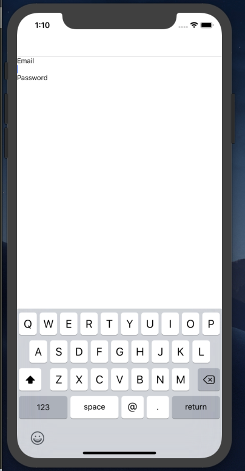
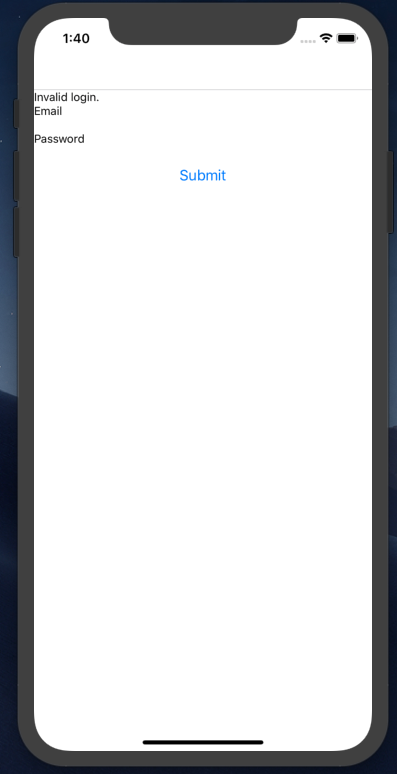
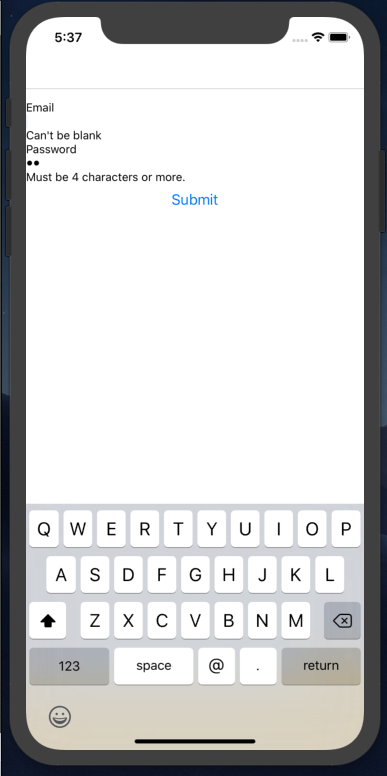
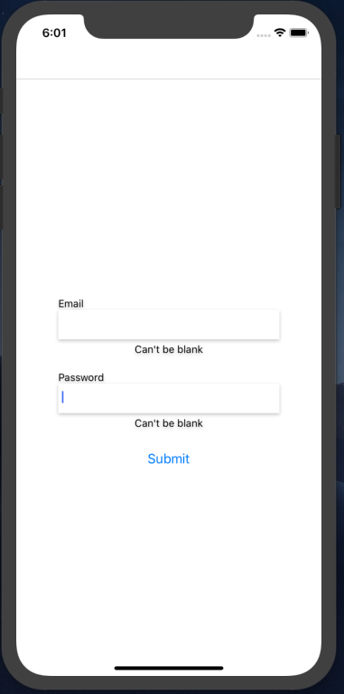
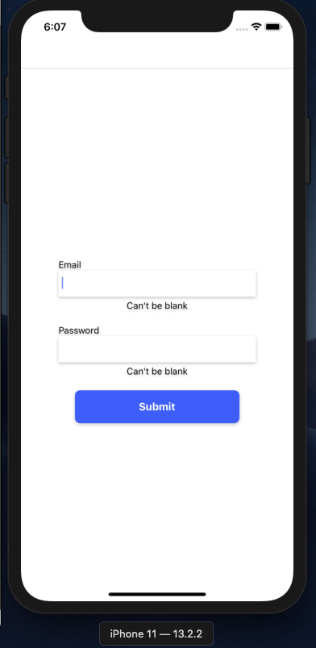
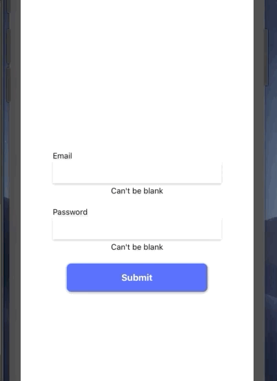
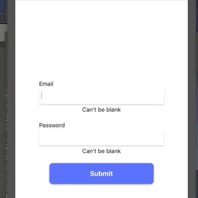

import ArticleLayout from "components/articles/ArticleLayout";

export const meta = {
  title: "Sexy forms in React Native",
  date: "2020-01-03T22:12:03.284Z",
  description: "Learn how to build beautiful & well-engineered forms for iOS",
};


My last tutorial was on how to write [a simple login/signup flow in React Native](https://scottdomes.dev/articles/react-native-authentication/). That tutorial was itself a sequel to a tutorial on making [a simple login/signup back-end in Rails](https://scottdomes.dev/articles/rails-authentication/). So I guess you can say I’ve been on an authentication kick.

There’s a reason for that. Authentication is essential boilerplate. Almost every app has to do it. It’s universal, so we might as well learn to do it well.

But while my last tutorial was intended to be a simple intro to authentication in React Native, what we ended up with was just a passable product. Our login form does the job but isn't particularly pretty, and isn't particular well engineered.

This tutorial will fix that. We’re going to make a beautiful form for our app: beautiful inside and out. It’ll have a bunch of cool stuff in it, and some solid code. Once complete, you can reuse this form for your next app, and the one after that.

## Why forms?

Forms are kind of boring for developers. Mostly because they ARE boilerplate-y, and they always take longer than you expect (especially in React).

But when it comes down to it, most apps are just fancy forms. Most have pages and pages of forms for you to fill out as part of the core functionality.

Making good forms is a big part of modern app design. So let’s make a good one.

## Good form principles

All forms should handle the basics:

- A user can enter the necessary information
- A user can submit the form

Beyond that, there's some stuff that most do well, but some (bafflingly) do not:

- A user should know when they filled the form out incorrectly (i.e. validation errors)
- A user should know when the form is submitting (i.e. loading state)
- A user should know what fields are for what (i.e. have labels for your fields, you dingbats. And no, placeholder text doesn't count)
- A user should know EXACTLY which fields have which errors

That's the user stuff. That's priority one.

But there's a good chance your app will have multiple forms. Perhaps many, many forms. Can we make them painless to build, too? Can we make reuseable form components that take away the legwork?

From a developer standpoint, we can also say:

- a developer should be able to create a basic form with just a few lines of code
- a developer should be able to specify various options for a form with only a few more lines

## A good form component

With the above developer stories, here's what I have in mind: a `<Form />` component that takes a `fields` props that specifies which inputs to create.

We could start with something like this:

```js
<Form fields={["First Name", "Email", "Password"]} />
```

... which would create a form with three inputs.

That's fine, but we need more control than that. For example, the password field needs to have secure text entry (obfuscate the input). The email field should trigger the email keyboard on the phone.

Here's a more sophisticated version:

```js
<Form
  fields={{
    firstName: {
      label: "First Name",
    },
    email: {
      label: "Email",
      keyboardType: "email-address",
    },
    password: {
      label: "Password",
      secureTextEntry: true,
    },
  }}
/>
```

This approach lets us pass in exactly the options we want for each input.

But there's one more wrinkle. Each field will likely have different validation rules. For example, we might insist that the user enters an actual, uh, email in the email field. For the password, we might want a length of eight characters.

What if we could also supply the validation for each field?

```js
<Form
  fields={
    {
      firstName: {
        label: 'First Name'
      },
      email: {
        label: 'Email',
        validators: [validateContent]
        inputProps: {
          keyboardType: 'email-address',
        }
      },
      password: {
        label: 'Password',
        validators: [validateContent, validateLength]
        inputProps: {
          secureTextEntry: true
        }
      }
    }
  }
/>
```

Now each field takes a `validators` array, which is just an array of functions. One such validator might look like so:

```js
export const validateContent = (text) => {
  if (!text) {
    return "Can't be blank";
  }
};
```

If there's an error, it returns a message. Otherwise it returns `undefined`.

We also split things like `secureTextEntry` into an `inputProps` key to designate that they are props that will be passed directly to the underlying input component.

Okay, so that's the plan! Our challenge here is to A) make it work and B) make it pretty.

## Getting started

For the purposes of this tutorial, I'm going to assume you followed [my initial guide for React Native authentication](https://scottdomes.dev/articles/react-native-authentication/).

If you haven't and can't be bothered to, the gist is that we have three main screens: `HomeScreen`, `LoginScreen`, and `CreateAccountScreen`. The latter two share an `EmailForm` component. We also have a `fetch` utility for communicating with our back-end.

The first thing we're going to do is improve that utility.

## Formatting request results

In our first tutorial, we built fetch methods like so:

```js
export const post = async (destination, body) => {
  const headers = await getHeaders();

  const result = await fetch(`${API_URL}${destination}`, {
    method: "POST",
    headers,
    body: JSON.stringify(body),
  });

  if (result.ok) {
    return await result.json();
  }
  throw { error: result.status };
};
```

Basically, if the request was good, we return the data. If it wasn't, we throw an error.

While working on this tutorial, I decided I didn't love that approach. Throwing errors is a bit strange and unpredictable for the engineers using these methods. I decided I'd rather return a uniform result object with all the relevant info.

Here's what we want to return from every single request:

```js
const formattedResult = {
  status: result.status, // The HTTP code e.g. 404
  ok: result.ok, // Boolean value as to whether the request succeeded
  data: await res.json(), // Parsed JSON of the actual data. We only want this if the request succeeds
};
```

So with the above in mind, let's introduce a new method to `src/api/fetch.js`:

```js
const formatResult = async (result) => {
  const formatted = {
    status: result.status,
    ok: result.ok,
  };

  if (result.ok) {
    formatted.data = await result.json();
  }

  return formatted;
};
```

This is a nice clean, asynchronous method we can now invoke from our `get` and `post` methods:

```js
export const post = async (destination, body) => {
  const headers = await getHeaders();

  const result = await fetch(`${API_URL}${destination}`, {
    method: "POST",
    headers,
    body: JSON.stringify(body),
  });

  const formattedResult = await formatResult(result);
  return formattedResult;
};
```

Is this essential? No. Will it make our lives easier down the line? Yes.

## Setting up our form

You know that nice, lovely `EmailForm` component we made last time? Delete it.

Yep, we're starting from scratch. Delete it and make a file in `src/forms/` called `Form.js`.

Here's what we can start with:

```jsx
import React from "react";
import { Text } from "react-native";

const Form = () => {
  return <Text>I am FORM</Text>;
};

export default Form;
```

High-end engineering, this.

Rewrite `LoginScreen` and `CreateAccountScreen` to look like so:

```jsx
import React from "react";
import Form from "../forms/Form";

const CreateAccount = ({ navigation }) => {
  return <Form />;
};

export default CreateAccount;
```

Your app should now look like so:


Great start?

One more logistical thing: let's make the login screen the first screen we land on for development purposes. In `App.js`, change the `initialRouteName` to `'Login'`.

## Form options

Since we already have an idea of the props structure of our form, let's fill that in, then make it work.

In `LoginScreen`:

```jsx
import React from "react";
import Form from "../forms/Form";

const LoginScreen = ({ navigation }) => {
  return (
    <Form
      fields={{
        email: {
          label: "Email",
          inputProps: {
            keyboardType: "email-address",
          },
        },
        password: {
          label: "Password",
          inputProps: {
            secureTextEntry: true,
          },
        },
      }}
    />
  );
};

export default LoginScreen;
```

Our login form will have an `email` and a `password` field. The email field will trigger the user's phone's email keyboard, and the password field will have obfuscated text entry. The only thing missing here is the validation, which we'll leave for later.

In our `Form` component, we now need to create an input for each field:

```jsx
import React from "react";
import { Text, TextInput, View } from "react-native";

const Form = ({ fields }) => {
  const fieldKeys = Object.keys(fields);

  return fieldKeys.map((key) => {
    const field = fields[key];
    return (
      <View key={key}>
        <Text>{field.label}</Text>
        <TextInput {...field.inputProps} />
      </View>
    );
  });
};

export default Form;
```

We iterate over the `keys` of the `fields` object, and use that to create a `TextInput` and label for each one. For the `inputProps`, we just spread them over the input component. Note that this approach is not very tightly controlled: it's up to the engineer using `Form` to implement everything correctly.

This should yield the following result:



## Controlling values

Our inputs are currently uncontrolled. When text is entered and their values change, we don't keep track of it. But we need to.

We're going to dynamically create a `values` object and store that in the state of `Form`. Here's what that looks like, using React hooks:

```jsx
import React, { useState } from "react";
import { Text, TextInput, View } from "react-native";

const getInitialState = (fieldKeys) => {
  const state = {};
  fieldKeys.forEach((key) => {
    state[key] = "";
  });

  return state;
};

const Form = ({ fields }) => {
  const fieldKeys = Object.keys(fields);
  const [values, setValues] = useState(getInitialState(fieldKeys));

  const onChangeValue = (key, value) => {
    const newState = { ...values, [key]: value };
    setValues(newState);
  };

  return fieldKeys.map((key) => {
    const field = fields[key];
    return (
      <View key={key}>
        <Text>{field.label}</Text>
        <TextInput
          {...field.inputProps}
          value={values[key]}
          onChangeText={(text) => onChangeValue(key, text)}
        />
      </View>
    );
  });
};

export default Form;
```

We use a `getInitialState` function to construct an object with an empty string assigned to each field key. We then pass a `value` and `onChangeText` prop to `TextInput`, which calls a method that updates the entire state object.

Since it's impossible for a user to update multiple fields at once, we don't have to worry about race conditions here.

You can test this is working by `console.log(values)` right before the `return`, and then typing some content into our fields.

## Submitting

First let's create a 'submit' button for our form, and then we'll talk about what happens when it's clicked.

The button in `Form.js`:

```jsx
return (
  <View>
    {fieldKeys.map((key) => {
      const field = fields[key];
      return (
        <View key={key}>
          <Text>{field.label}</Text>
          <TextInput
            {...field.inputProps}
            value={values[key]}
            onChangeText={(text) => onChangeValue(key, text)}
          />
        </View>
      );
    })}
    <Button title={buttonText} />
  </View>
);
```

This requires a new `buttonText` prop for `Form`. Create that prop and then pass in "Submit" from `LoginScreen`.

The result:


Great, but it doesn't _do_ anything. So what do we want to happen?

Well, we need to send the values for the `email` and `password` fields to the back-end. This is specific to _this_ form, so we need the submit action to be a custom prop passed to `Form`.

In `LoginScreen`:

```jsx
import React from "react";
import Form from "../forms/Form";
import { login } from "../api/authentication";

const LoginScreen = ({ navigation }) => {
  return (
    <Form
      action={login}
      buttonText="Submit"
      fields={{
        email: {
          label: "Email",
          inputProps: {
            keyboardType: "email-address",
          },
        },
        password: {
          label: "Password",
          inputProps: {
            secureTextEntry: true,
          },
        },
      }}
    />
  );
};

export default LoginScreen;
```

We pass a new `action` prop to decide what to happen. Now, let's make it work:

```jsx
const Form = ({ fields, buttonText, action }) => {
  // ... same code

  const getValues = () => {
    return fieldKeys.sort().map((key) => values[key]);
  };

  const submit = async () => {
    const values = getValues();
    const result = await action(...values);
    console.log(result);
  };

  // ... same code
  // But add the onPress:
  <Button title={buttonText} onPress={submit} />;
  // ... same code
};
```

First, we create a `submit` function and grab the values from state. Then we pass those values to the `action` prop, spreading the array as arguments. Note that `getValues` calls `sort` on the keys, which means the values will be passed to the action in alphabetical order. This makes our output easier to predict.

Here's our old `login` method we made before:

```js
export const login = (email, password) => {
  return post("/users/login", {
    user: { email, password },
  });
};
```

Based on our new code, this should just work. Our `console.log` should spit out this result for a successful login:

```js
{status: 200, ok: true, data: {…}}
```

For a wrong email/password combination:

```js
{status: 401, ok: false}
```

Great work!

## After submission

After a successful login submission, we want to redirect them to the home page. After a failed submission, we want to display a message like 'Invalid email/password combination'.

Again, this is something that will differ between each form. So let's make a new prop for `Form.js` called `afterSubmit`.

```jsx
import React from "react";
import Form from "../forms/Form";
import { login } from "../api/authentication";
import { setToken } from "../api/token";

const LoginScreen = ({ navigation }) => {
  const handleResult = async (result) => {
    if (result.ok && result.data) {
      await setToken(result.data.auth_token);
      navigation.navigate("Home");
    } else if (result.status === 401) {
      throw new Error("Invalid login.");
    } else {
      throw new Error("Something went wrong.");
    }
  };

  return (
    <Form
      action={login}
      afterSubmit={handleResult}
      buttonText="Submit"
      fields={{
        email: {
          label: "Email",
          inputProps: {
            keyboardType: "email-address",
          },
        },
        password: {
          label: "Password",
          inputProps: {
            secureTextEntry: true,
          },
        },
      }}
    />
  );
};

export default LoginScreen;
```

Now, when the `afterSubmit` prop is called, we'll check the result. If the result of the request is a success, we take the token and redirect to the HomeScreen. If the result is a 401, we tell the user their login was invalid. If the result is anything else, we show a general error message.

And yes, we're bringing back error throwing! Here, we're using it in a more specific setting, to indicate a failed request and thus tell the form to show an error. Here, I believe it makes sense.

Here's our new `submit` method in `Form.js`:

```jsx
const Form = ({ fields, buttonText, action, afterSubmit }) => {
  const fieldKeys = Object.keys(fields);
  const [values, setValues] = useState(getInitialState(fieldKeys));

  const onChangeValue = (key, value) => {
    const newState = { ...values, [key]: value };
    setValues(newState);
  };

  const getValues = () => {
    return fieldKeys.sort().map((key) => values[key]);
  };

  const submit = async () => {
    const values = getValues();
    try {
      const result = await action(...values);
      await afterSubmit(result)
    } catch(e) {
      console.log('error:', e)
    }
  };
```

Now, we call `afterSubmit` (wrapped in a try/catch). If there's an error, we should see it logged out. If the login succeeds, we should go to the home page.

Last thing: we need to display the error to the user:

```jsx
const Form = ({ fields, buttonText, action, afterSubmit }) => {
  const fieldKeys = Object.keys(fields);
  const [values, setValues] = useState(getInitialState(fieldKeys));
  const [errorMessage, setErrorMessage] = useState("");

  // rest of code

  const submit = async () => {
    const values = getValues();
    try {
      const result = await action(...values);
      await afterSubmit(result);
    } catch (e) {
      setErrorMessage(e.message);
    }
  };

  return (
    <View>
      <Text>{errorMessage}</Text>
      // rest of code
    </View>
  );
};
```

We create an `errorMessage` hook and set it to the error message in our catch. Then, we display it to the user. The result, after a failed login:



## Validation

You may notice in the above screenshots that I submitted a blank email + password. This is obviously an invalid login, and it is not worth making a request to the back-end to find that out.

We need some front-end validation to check our fields before we submit them. Let's create some functions to do so in a new file, `src/forms/validation.js`:

```js
export const validateContent = (text) => {
  if (!text) {
    return "Can't be blank";
  }
};

export const validateLength = (text) => {
  if (text && text.length < 4) {
    return "Must be 4 characters or more.";
  }
};
```

These two functions are designed to be called with the text of the field. If the text is not correct, they return a human-readable error. If the text is fine, they return `undefined`.

Let's create the `validators` field we came up with earlier, in `LoginScreen.js`:

```jsx
import React from "react";
import Form from "../forms/Form";
import { login } from "../api/authentication";
import { setToken } from "../api/token";
import { validateContent, validateLength } from "../forms/validation";

const LoginScreen = ({ navigation }) => {
  // Old code

  return (
    <Form
      action={login}
      afterSubmit={handleResult}
      buttonText="Submit"
      fields={{
        email: {
          label: "Email",
          validators: [validateContent],
          inputProps: {
            keyboardType: "email-address",
          },
        },
        password: {
          label: "Password",
          validators: [validateContent, validateLength],
          inputProps: {
            secureTextEntry: true,
          },
        },
      }}
    />
  );
};

export default LoginScreen;
```

Each field now has a `validators` array that describes what we want to check for. For the email, we just want some text entered. For the password, we want text entered, and for it to be a specific length. In the latter case, these two are probably redundant, but I wanted to show an example of multiple validators, so bear with me.

We're going to introduce several new methods to handle validation. In `src/forms/validation.js`, make a function called `validateField`:

```js
export const validateField = (validators, value) => {
  let error = "";
  validators.forEach((validator) => {
    const validationError = validator(value);
    if (validationError) {
      error = validationError;
    }
  });
  return error;
};
```

This function takes an array of validators, and the value of a field. It runs the value against the validators and returns the last error found.

Another function called `validateFields`:

```js
export const validateFields = (fields, values) => {
  const errors = {};
  const fieldKeys = Object.keys(fields);
  fieldKeys.forEach((key) => {
    const field = fields[key];
    const validators = field.validators;
    const value = values[key];
    if (validators && validators.length > 0) {
      const error = validateField(validators, value);

      if (error) {
        errors[key] = error;
      }
    }
  });

  return errors;
};
```

This one is more complex. It takes our `fields` object and our `values` object and does the unsexy work of calling `validateField` for each one. It will give us back an `errors` object that is constructed the same way as `fields` or `values`: with the fieldName as the key, and the error message as the value.

One more, `hasValidationError`:

```js
export const hasValidationError = (errors) => {
  return Object.values(errors).find((error) => error.length > 0);
};
```

This one checks our new `errors` object and sees if any of the errors are populated. If they are, we can then cancel the back-end request.

Okay, let's hop back to `Form.js` and wire it up.

First, let's introduce an `validationErrors` object to state:

```jsx
const Form = ({ fields, buttonText, action, afterSubmit }) => {
  const fieldKeys = Object.keys(fields);
  const [values, setValues] = useState(getInitialState(fieldKeys));
  const [errorMessage, setErrorMessage] = useState('');
  const [validationErrors, setValidationErrors] = useState(
    getInitialState(fieldKeys),
  );
```

Import both `hasValidationError` and `validateFields`, and we can add them to our `submit` function:

```js
const submit = async () => {
  setErrorMessage("");
  setValidationErrors(getInitialState(fieldKeys));

  const errors = validateFields(fields, values);
  if (hasValidationError(errors)) {
    console.log(errors);
    return setValidationErrors(errors);
  }
  try {
    const result = await action(...getValues());
    await afterSubmit(result);
  } catch (e) {
    setErrorMessage(e.message);
  }
};
```

This function has a new flow:

1. Erase any existing validation errors or general error messages.
2. Validate the fields for new errors.
3. If a validation error exists, we bow out at this point.
4. If there are no errors, submit the request.

Last piece: in our `map`, let's add the error message below the field:

```jsx
{
  fieldKeys.map((key) => {
    const field = fields[key];
    const fieldError = validationErrors[key];
    return (
      <View key={key}>
        <Text>{field.label}</Text>
        <TextInput
          {...field.inputProps}
          value={values[key]}
          onChangeText={(text) => onChangeValue(key, text)}
        />
        <Text>{fieldError}</Text>
      </View>
    );
  });
}
```

The result:



## Clearing validation on change

One small UX improvement we can make right away is to clear validation errors when the user types in the form. This is pretty easy to do:

```jsx
const onChangeValue = (key, value) => {
  const newState = { ...values, [key]: value };
  setValues(newState);

  if (validationErrors[key]) {
    const newErrors = { ...validationErrors, [key]: "" };
    setValidationErrors(newErrors);
  }
};
```

If the field has an error on change, we erase it.

We could get more sophisticated here, and run the validator to see if the error is fixed... but let's not go too far down the rabbit hole here.

## Checkpoint

We now have a fully working form with good user experience. But it is not, as the title of this post implies, particulary beautiful. Our next step will be to add some pizzazz.

Here are our planned improvements:

1. Clean up the basic styles
2. Introduce a colorful button with a press animation.
3. Fade out the form slightly when it is submitting.
4. Show an activity indicator on submission.
5. Add a shake animation when a field has an error.

## Splitting up components

Before we start styling, let's break up our components a bit.

Make a new component in `src/forms/` called `Field.js`:

```jsx
import React, { useState } from "react";
import { Text, TextInput, View, StyleSheet } from "react-native";

const Field = ({ fieldName, field, value, onChangeText, error }) => {
  return (
    <View>
      <Text>{field.label}</Text>
      <TextInput
        {...field.inputProps}
        value={value}
        onChangeText={(text) => onChangeText(fieldName, text)}
      />
      <Text>{error}</Text>
    </View>
  );
};

const styles = StyleSheet.create({});

export default Field;
```

Nothing new here, just some code extracted from `Form`. I also got a StyleSheet ready, since we'll be using that next.

And in `Form.js`:

```jsx
return (
  <View>
    <Text>{errorMessage}</Text>
    {fieldKeys.map((key) => {
      return (
        <Field
          key={key}
          fieldName={key}
          field={fields[key]}
          error={validationErrors[key]}
          onChangeText={onChangeValue}
          value={values[key]}
        />
      );
    })}
    <Button title={buttonText} onPress={submit} />
  </View>
);
```

Ensure everything is working as before.

## Form styles

Add a `StyleSheet` to `Form.js` with the following values:

```js
const styles = StyleSheet.create({
  container: {
    flex: 1,
    alignItems: "center",
    justifyContent: "center",
    marginBottom: 15,
  },
  error: {
    marginBottom: 20,
    height: 17.5,
  },
});
```

Then to your outermost `View`, add the `style` prop: `<View style={styles.container}>`.
Do the same for our general error message `Text`: ` <Text style={styles.error}>{errorMessage}</Text>`

That will center and align our form. Let's hop back over to `Field.js` and add some styles there:

```js
const styles = StyleSheet.create({
  input: {
    height: 40,
    width: 300,
    paddingHorizontal: 5,
    backgroundColor: "white",
    marginBottom: 5,
  },
  inputContainer: {
    marginBottom: 20,
    shadowColor: "#000",
    shadowOffset: {
      width: 0,
      height: 2,
    },
    shadowOpacity: 0.23,
    shadowRadius: 2.62,
    elevation: 4,
  },
  error: { textAlign: "center", height: 17.5 },
});
```

Here's what the props look like:

```jsx
const Field = ({ fieldName, field, value, onChangeText, error }) => {
  return (
    <View style={styles.inputContainer}>
      <Text>{field.label}</Text>
      <TextInput
        style={styles.input}
        {...field.inputProps}
        value={value}
        onChangeText={(text) => onChangeText(fieldName, text)}
      />
      <Text style={styles.error}>{error}</Text>
    </View>
  );
};
```

Notice that the `style` prop for the `TextInput` is placed before we spread the `inputProps`, which means consumers of this component could override our styling, if need be.

All this should yield the following result:



## A more colourful button

First, let's replace our existing Button with a custom component called `SubmitButton`. Keep it in the same `forms/` directory.

```jsx
import React, { useState } from "react";
import { TouchableWithoutFeedback, View, Text, StyleSheet } from "react-native";

const SubmitButton = ({ title, onPress }) => {
  return (
    <TouchableWithoutFeedback onPress={onPress}>
      <View style={styles.container}>
        <Text style={styles.text}>{title}</Text>
      </View>
    </TouchableWithoutFeedback>
  );
};

const styles = StyleSheet.create({
  container: {
    shadowColor: "#000",
    shadowOffset: {
      width: 0,
      height: 2,
    },
    backgroundColor: "#3F5EFB",
    shadowOpacity: 0.23,
    shadowRadius: 2.62,
    width: 250,
    elevation: 4,
    borderRadius: 8,
    height: 50,
    justifyContent: "center",
    alignItems: "center",
    paddingHorizontal: 80,
  },
  text: {
    color: "white",
    fontSize: 16,
    fontWeight: "bold",
  },
});

export default SubmitButton;
```

You can then swap that out for the `Button` in `Form.js`:



It looks nice, but it gives no indication of being clicked when the user presses it. Let's fix that.

## Button animation

Our animation is going to be quite simple: when the button is pressed, the button will move down and get smaller. Here's the final effect:


We're going to use the `Animated` library that comes with React Native to achieve this effect. We'll start with two animated values: `offset` and `scale`. Offset will control the button's position, scale its size.

```jsx
const SubmitButton = ({ title, onPress }) => {
  const [offset] = useState(new Animated.Value(1));
  const [scale] = useState(new Animated.Value(1));
```

Both values start at `1`, the normal scale and position.

From there, we construct a `transform` style array, and apply it to our container:

```jsx
const SubmitButton = ({ title, onPress }) => {
  const [offset] = useState(new Animated.Value(1));
  const [scale] = useState(new Animated.Value(1));

  const transform = [
    { translateY: offset },
    { scaleY: scale },
    { scaleX: scale },
  ];

  return (
    <TouchableWithoutFeedback onPress={onPress}>
      <Animated.View style={{ transform, ...styles.container }}>
        <Text style={styles.text}>{title}</Text>
      </Animated.View>
    </TouchableWithoutFeedback>
  );
};
```

Note the conversion of the `View` to an `Animated.View`. This is necessary for any elements that can be animated.

Lastly, we make a new `handlePress` function:

```jsx
const SubmitButton = ({ title, onPress }) => {
  const [offset] = useState(new Animated.Value(1));
  const [scale] = useState(new Animated.Value(1));

  const handlePress = async () => {
    Animated.spring(offset, {
      toValue: 5,
    }).start();
    Animated.spring(scale, {
      toValue: 0.96,
    }).start();

    await onPress();
    Animated.spring(offset, {
      toValue: 0,
    }).start();
    Animated.spring(scale, {
      toValue: 1,
    }).start();
  };

  const transform = [
    { translateY: offset },
    { scaleY: scale },
    { scaleX: scale },
  ];

  return (
    <TouchableWithoutFeedback onPressIn={handlePress}>
      <Animated.View style={{ transform, ...styles.container }}>
        <Text style={styles.text}>{title}</Text>
      </Animated.View>
    </TouchableWithoutFeedback>
  );
};
```

Here's the result again:


## Fading the form

When our form is being submitted, we want to fade the opacity a bit, as a visual way of letting the user know things are happening.

Again, we'll use an `Animated.Value`, this time in `Form.js`:

```jsx
const Form = ({ fields, buttonText, action, afterSubmit }) => {
  const fieldKeys = Object.keys(fields);
  const [values, setValues] = useState(getInitialState(fieldKeys));
  const [errorMessage, setErrorMessage] = useState('');
  const [validationErrors, setValidationErrors] = useState(
    getInitialState(fieldKeys),
  );
  const [opacity] = useState(new Animated.Value(1));
```

We only want to fade the fields (not the button) so let's add a new wrapping `Animated.View`:

```jsx
  return (
    <View style={styles.container}>
      <Text style={styles.error}>{errorMessage}</Text>
      <Animated.View style={{ opacity }}>
        {fieldKeys.map((key) => {
          return (
            <Field
              key={key}
              fieldName={key}
              field={fields[key]}
              error={validationErrors[key]}
              onChangeText={onChangeValue}
              value={values[key]}
            />
          );
        })}
      </Animated.View>
      <SubmitButton title={buttonText} onPress={submit} />
    </View>
  );
};
```

And we'll add new functions and expand our `submit` function:

```js
const fadeOut = () =>
  Animated.timing(opacity, { toValue: 0.2, duration: 200 }).start();

const fadeIn = () =>
  Animated.timing(opacity, { toValue: 1, duration: 200 }).start();

const submit = async () => {
  setErrorMessage("");
  setValidationErrors(getInitialState(fieldKeys));

  const errors = validateFields(fields, values);
  if (hasValidationError(errors)) {
    return setValidationErrors(errors);
  }

  fadeOut();
  try {
    const result = await action(...getValues());
    fadeIn();
    await afterSubmit(result);
  } catch (e) {
    setErrorMessage(e.message);
    fadeIn();
  }
};
```

The result:


## Adding activity indicators

Let's add more visual feedback. React Native comes with an `ActivityIndicator` component that we can add to both our button and our form.

For the form, we'll need a new `isSubmitting` state piece:

```jsx
const Form = ({ fields, buttonText, action, afterSubmit }) => {
  const fieldKeys = Object.keys(fields);
  const [values, setValues] = useState(getInitialState(fieldKeys));
  const [errorMessage, setErrorMessage] = useState('');
  const [validationErrors, setValidationErrors] = useState(
    getInitialState(fieldKeys),
  );
  const [opacity] = useState(new Animated.Value(1));
  const [isSubmitting, setSubmitting] = useState(false);
```

Add it to `submit`:

```jsx
const submit = async () => {
  setSubmitting(true);
  setErrorMessage("");
  setValidationErrors(getInitialState(fieldKeys));

  const errors = validateFields(fields, values);
  if (hasValidationError(errors)) {
    return setValidationErrors(errors);
  }

  fadeOut();
  try {
    const result = await action(...getValues());
    await afterSubmit(result);
    fadeIn();
  } catch (e) {
    setErrorMessage(e.message);
    setSubmitting(false);
    fadeIn();
  }
};
```

And finally, add the component:

```jsx
return (
  <View style={styles.container}>
    <Text style={styles.error}>{errorMessage}</Text>
    <Animated.View style={{ opacity }}>
      {isSubmitting && (
        <View style={styles.activityIndicatorContainer}>
          <ActivityIndicator size="large" color="#3F5EFB" />
        </View>
      )}
      {fieldKeys.map((key) => {
        return (
          <Field
            key={key}
            fieldName={key}
            field={fields[key]}
            error={validationErrors[key]}
            onChangeText={onChangeValue}
            value={values[key]}
          />
        );
      })}
    </Animated.View>
    <SubmitButton title={buttonText} onPress={submit} />
  </View>
);
```

To center it, we need to make a few changes to our styles, including ensuring the container is `position: relative`:

```js
const styles = StyleSheet.create({
  container: {
    flex: 1,
    alignItems: "center",
    justifyContent: "center",
    marginBottom: 15,
    position: "relative",
  },
  activityIndicatorContainer: {
    position: "absolute",
    flex: 1,
    top: 0,
    left: 0,
    right: 0,
    bottom: 0,
    justifyContent: "center",
    alignItems: "center",
    zIndex: 2,
  },
  error: {
    marginBottom: 20,
    height: 17.5,
  },
});
```

Since we also want our button to display an indicator, pass `isSubmitting` down to it: `<SubmitButton title={buttonText} onPress={submit} isSubmitting={isSubmitting} />`

Then, inside the button:

```jsx
return (
  <TouchableWithoutFeedback onPressIn={handlePress}>
    <Animated.View style={{ transform, ...styles.container }}>
      <View style={styles.container}>
        {isSubmitting ? (
          <ActivityIndicator size="small" color="#FFFFFF" />
        ) : (
          <Text style={styles.text}>{title}</Text>
        )}
      </View>
    </Animated.View>
  </TouchableWithoutFeedback>
);
```

The full effect:


This looks pretty good, but you might notice it feels a little janky. In this case, it's because the animation is too quick: our back-end responds _too fast_, which leads to a jerking stop-and-start animation.

To make our animation more intentional, we're actually going to slow down the back-end response. The easiest way to do this is to add a timeout.

First, we add a function for our timeout:

```jsx
const animationTimeout = () =>
  new Promise((resolve) => setTimeout(resolve, 700));

const Form = ({ fields, buttonText, action, afterSubmit }) => {
```

All this does is create a promise that resolves after 0.7 seconds.

Then, we use `Promise.all` in our `submit` function:

```js
const submit = async () => {
  setSubmitting(true);
  setErrorMessage("");
  setValidationErrors(getInitialState(fieldKeys));

  const errors = validateFields(fields, values);
  if (hasValidationError(errors)) {
    setSubmitting(false);
    return setValidationErrors(errors);
  }

  fadeOut();
  try {
    const [result] = await Promise.all([
      action(...getValues()),
      animationTimeout(),
    ]);
    await afterSubmit(result);
    fadeIn();
  } catch (e) {
    setErrorMessage(e.message);
    setSubmitting(false);
    fadeIn();
  }
};
```

`Promise.all` will only resolve once all promises passed to it resolve. In our case, it will resolve when both the request and the animation timeout resolve. If the request takes two seconds, the animation will last for two seconds, but if the request takes half a second, the animation will still take 0.7 seconds.

Note that we need to destructure `result` as `[result]` since `Promise.all` returns the result of both promises in an array.

The effect:


Note that `700` for the timeout is relatively arbitrary. It felt the best for me: not too long, but just long enough to lend a sense of grace. Experiment with shorter and longer timeouts and see what you like.

## Submission before validation

If we want to have the same submission effect _before_ validation errors are displayed (which leads to a less jarring experience), the fix is simple:

```js
const submit = async () => {
  setSubmitting(true);
  setErrorMessage('');
  setValidationErrors(getInitialState(fieldKeys));

  const errors = validateFields(fields, values);
  fadeOut();
  if (hasValidationError(errors)) {
    await animationTimeout();
    setSubmitting(false);
    fadeIn();
    return setValidationErrors(errors);
  }

  // try catch block
```

We `await` the `animationTimeout` before we set submitting to false. Note that we moved `fadeOut` up above the if-block, and also added `fadeIn` if there are validation errors. The new look for validation:


## Avoiding the keyboard

If you toggle the software keyboard in your emulator (CMD+K on Mac), you'll see we have a little problem.


Our user can't even submit the form!

Fortunately, this is easy to fix in React Native. Swap out our container `View` in `Form.js` for a `KeyboardAvoidingView`:

```jsx
return (
  <KeyboardAvoidingView style={styles.container} behavior="padding" enabled>
    <Text style={styles.error}>{errorMessage}</Text>
    <Animated.View style={{ opacity }}>
      {isSubmitting && (
        <View style={styles.activityIndicatorContainer}>
          <ActivityIndicator size="large" color="#3F5EFB" />
        </View>
      )}
      {fieldKeys.map((key) => {
        return (
          <Field
            key={key}
            fieldName={key}
            field={fields[key]}
            error={validationErrors[key]}
            onChangeText={onChangeValue}
            value={values[key]}
          />
        );
      })}
    </Animated.View>
    <SubmitButton
      title={buttonText}
      onPress={submit}
      isSubmitting={isSubmitting}
    />
  </KeyboardAvoidingView>
);
```

And the result:



## Adding a shake animation on validation error

When a specific field has a validation error, we want to briefly shake it to bring the user's attention to it.

We want to show the shake:

1. When the form was previously submitting, but now is not.
2. When the field has an error.

To do #1, we need to bring in [a lifecycle method](https://scottdomes.dev/articles/react-lifecycle/). Let's convert `Field` to a class component:

```jsx
import React from "react";
import { Text, TextInput, View, StyleSheet } from "react-native";

export default class Field extends React.Component {
  componentDidUpdate() {}

  render() {
    const { fieldName, field, value, onChangeText, error } = this.props;
    return (
      <View style={styles.inputContainer}>
        <Text>{field.label}</Text>
        <TextInput
          style={styles.input}
          {...field.inputProps}
          value={value}
          onChangeText={(text) => onChangeText(fieldName, text)}
        />
        <Text style={styles.error}>{error}</Text>
      </View>
    );
  }
}

const styles = StyleSheet.create({
  // Same styles
});
```

If you're unclear about what `componentDidUpdate` does, check [this article](https://scottdomes.dev/articles/react-lifecycle/).

Okay, let's update the lifecycle method to reflect the logic we described above:

```jsx
componentDidUpdate(prevProps) {
  if (
    prevProps.isSubmitting &&
    !this.props.isSubmitting &&
    this.props.error
  ) {
    this.shake();
  }
}
```

`this.shake` will be a new method we'll introduce to adjust a new `Animated.Value`.

Here's everything all together:

```jsx
export default class Field extends React.Component {
  position = new Animated.Value(0);

  shiftPosition(distance) {
    const duration = 50;
    return Animated.timing(this.position, {
      toValue: distance,
      duration,
      useNativeDriver: true,
    });
  }

  startShake = () => {
    const distance = 8;

    Animated.sequence([
      this.shiftPosition(distance),
      this.shiftPosition(-distance),
      this.shiftPosition(distance),
      this.shiftPosition(-distance),
      this.shiftPosition(distance),
      this.shiftPosition(0),
    ]).start();
  };

  shake() {
    setTimeout(this.startShake, 100);
  }
```

Here's what these methods do:

1. Introduce a new `Animated.Value` called `position`, which will refer to the input's transform.
2. Introdue a `shake` method that calls `startShake` after a brief timeout. This is to avoid shaking until the form's opacity has finished fading in.
3. Introduce `startShake`, which created a sequence of animations, moving the input's position back and forth.
4. Introduce `shiftPosition`, which returns an animation that moves the input to a specific point. (You can read more about `useNativeDriver` [here](https://facebook.github.io/react-native/blog/2017/02/14/using-native-driver-for-animated)).

Note that both `distance` and `duration` are arbitrary; they're just values that I think look good in the final shake.

Here's the effect:



## Conclusion

We did it! We now have a working form with lots of great UX affordances.

Not only that, we can easily create more of the same form by using the same component and adding different `fields` to the prop. Try using the same basis to make a form for our `CreateAccount` page.

Thanks for reading! If you learned something from this article, consider subscribing below! I rarely send out emails, but when I do, it's content like this.

export default ({ children }) => (
  <ArticleLayout meta={meta}>{children}</ArticleLayout>
);